# Dashboard

On successful login, a user is directed to the **_Dashboard_** which consists of the main menu on the left side. It consists of **_Organizational information, Employee profile, Leave details and Attendance._**

If the user signs up for the first time he/she will get the **_Admin role._**

Below shown screen will be displayed. The browser pop ups may appear if the user is getting logged on to the portal for the first time, users can save the credentials on the browser.

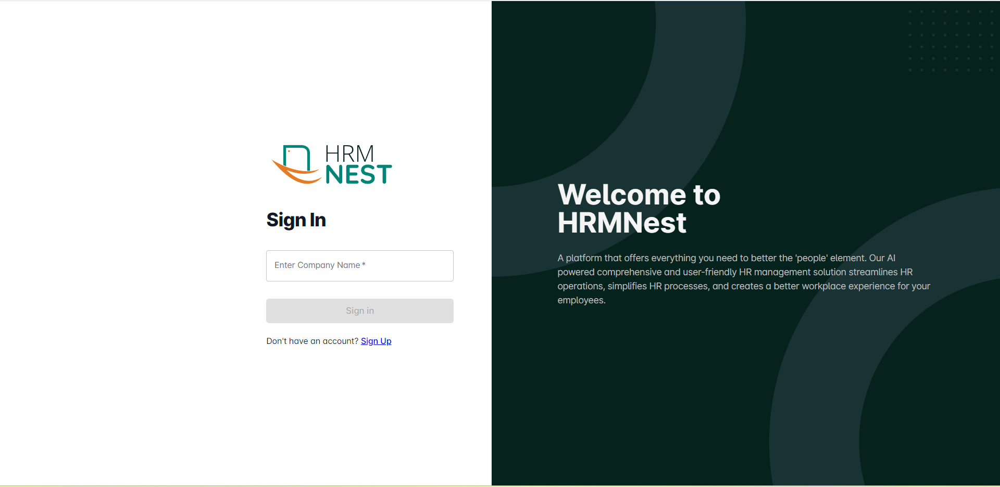

Click on the **_Three horizontal line symbols_** on the side panel will provide you a wide view of the the page

## Organization

The **_Organization section_** serves the purpose of maintaining and managing company details, policies and procedures. This section offers various features and tools that are specifically designed to assist HR managers and administrators in managing the workforce efficiently. The key elements of this section include: **_General info, Branches Job Type, Designation, Departments, Leave policy, Weekend policy, Holiday policy, Roles and permissions. _**

Click on the **_Organization _**on the left panel. A user(Admin) will be allowed to add more employees only after completing the **_Organization information._**

### General Info

The **_General info_** page provides basic information about the company using HRMNest. It includes the company name, website, and contact address.

Click on the **_General Info_** under the **_Organization module_**. A page will appear shown below.

Enter the **_Company name, Company Address and Company website link_** in corresponding fields. Users can upload the company logo by clicking on the**_ Upload company logo _**option. After completing the fields click on the **_Submit button._** The logo will be displayed on the side panel as well as the upload logo field.

#### Enable attendance app

Users can tick on the **_Enable attendance app_** check box if the organization wants to align the employee check in and check out with HRMNest application.

### Branches

This section contains information about the different branches or locations of the organization, including contact details, addresses, and other relevant information.

Click on the **_Branches_** option to add and view branches.

#### Add Branches

Click on the **_+Add Branch icon_** on the upper right side of the page to add new branches. A page like below will appear.

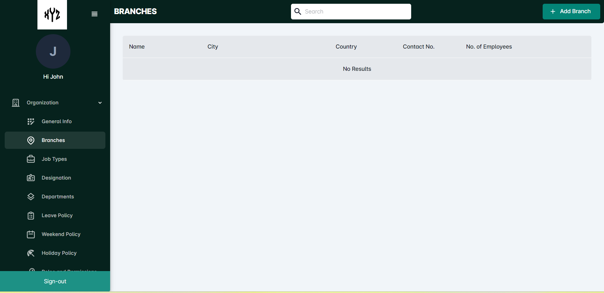

Enter the mandatory details and click on the **_Submit button_**. Users can discard the details by clicking the **_Cancel option._**

After successful addition of a new branch to HRMNest, it will appear as shown below.

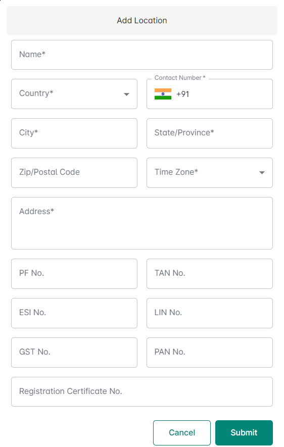

#### To view the branch details

Click on the **_Branch name_**to view the branch details. It will appear as shown below.

If the user needs to check a particular branch, he/she can utilize the search option on the top middle of the page.

#### To Edit the Branch details

Click on the**_ Edit icon_** on the right side of each branch. The users will be able to edit the details and can **_Submit _**it. A notification showing **_Successfully Updated_** will be displayed on the upper right of the page.

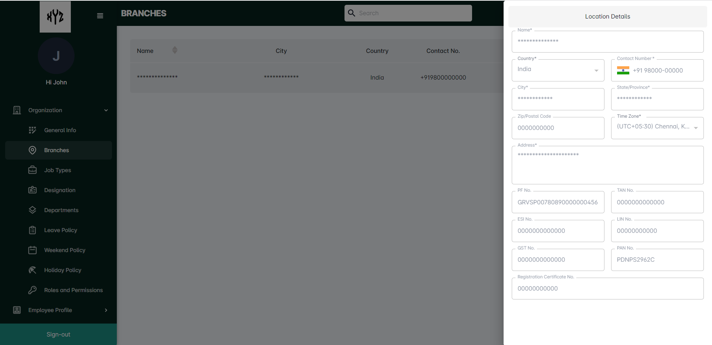

#### To Delete the Branch

Click on the **_Delete icon_** on the right side of each branch. A dialog box will appear asking for the command.

### Job Type

This section contains information about different job types and positions within the organization, such as full-time, part-time, contractual, or permanent positions.

Click on the **_Job Type _**option to view and add Job types

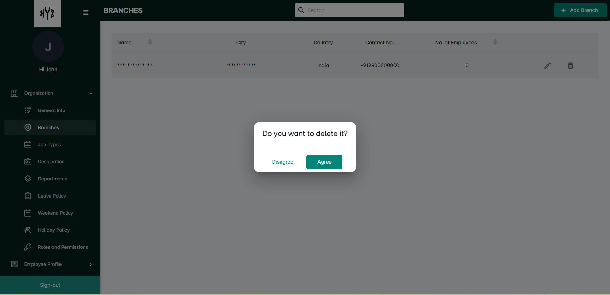

#### To add Job Type

Click on the **_+Add job Type_** option on the upper right side of the screen. It will open a side page like below.

Enter the **_Job type, Description, and the Series format_** ( Prefix and suffix is not mandatory) on the provided fields and enter the **_Submit button. _**

After successful addition of a job type it will be displayed as shown below.

#### To view the Details

Click on the name of the particular**_ Job type _**to view the details. It will display as shown below.

If the user needs to check a particular job type details he/she can utilize the **_Search option_** on the top middle of the page.

#### To Edit the details

Click on the **_Edit icon_** on the right side of each job type to edit the details. After editing, click on the **_Submit button._**

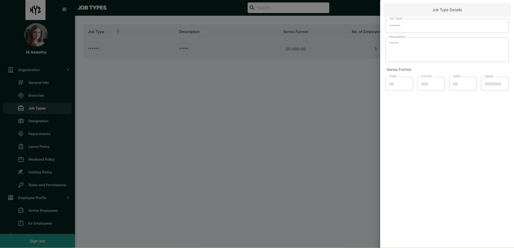

#### To Delete the Job type

Click on the**_ Delete icon_** next to the edit icon on the same page. It will open a command box as shown below.

### Designation

This section includes information about the designation of different positions, such as Manager, Executive, or Supervisor.

Click on the **_Designation_** option in the sidebar to view and add Designations.

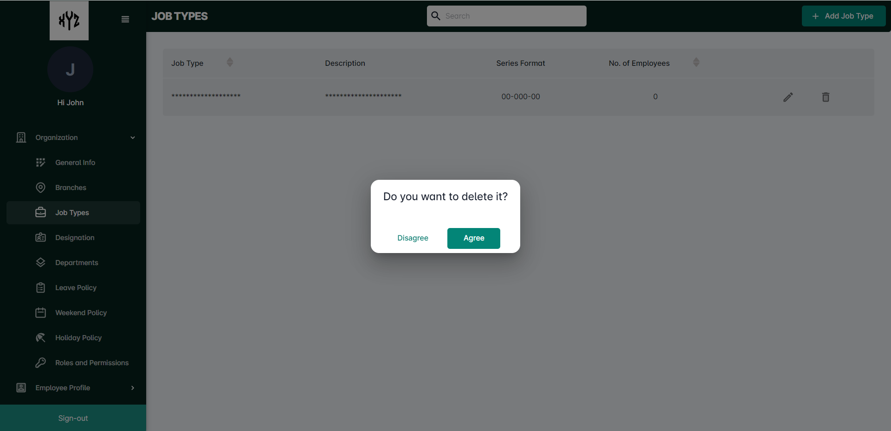

#### To Add a Designation

Click on the **_+Add Designation_** button on the upper right side of the page. A Side panel will open like shown below.

Enter the **_Designation name, Description and Code_**( Not Mandatory) on corresponding fields and click the **_Submit button. _**

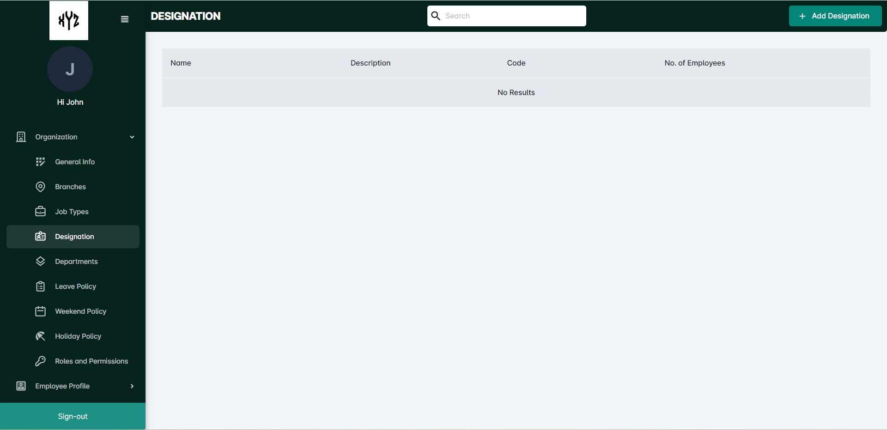

After successful addition of the **_Designation _**it will be displayed on the page as shown below.

#### To View the Details

Click on a particular name of the **_Designation_** to view the details. It will appear as shown below.

If the user needs to check a particular**_ Designation_** he/she can utilize the **_Search Bar_** on the top middle of the page.

#### To Edit the Details

Click on the **_Edit icon_** on the right side of each Designation to edit the details. It will open a side panel with details enabled to edit and submit.

#### To Delete the Designation

Click on the **_Delete icon _**next to the Edit icon to delete a particular Designation. It will open a command box.

### Departments

This section contains information about different departments within the organization, such as Sales, Marketing, Finance, or Human Resources.

Click on the **_Department option_** in the sidebar to view and add Departments.

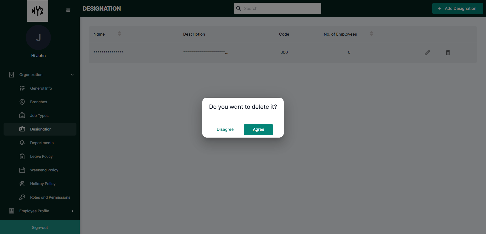

#### To Add Departments

Click on the **_+AddDepartment_** button on the upper right side of the page. A Side panel will open like shown below.

Enter the **_Department name , Description and Code_** ( Not Mandatory) on corresponding fields and click the**_ Submit button. _**

After successful addition of the **_Department_** it will be displayed on the page as shown below.

#### To View the Details

Click on a particular name of the Department to view the details. It will appear as shown below.

If the user needs to check a particular **_Department _**he/she can utilize the**_ Search Bar_** on the top middle of the page.

#### To Edit the Details

Click on the Edit icon on the right side of each **_Department _**to edit the details. It will open a side panel with details enabled to **_edit and submit_**.

#### To Delete the Department

Click on the **_Delete icon_** next to the Edit icon to delete a particular Department. It will open a command box.

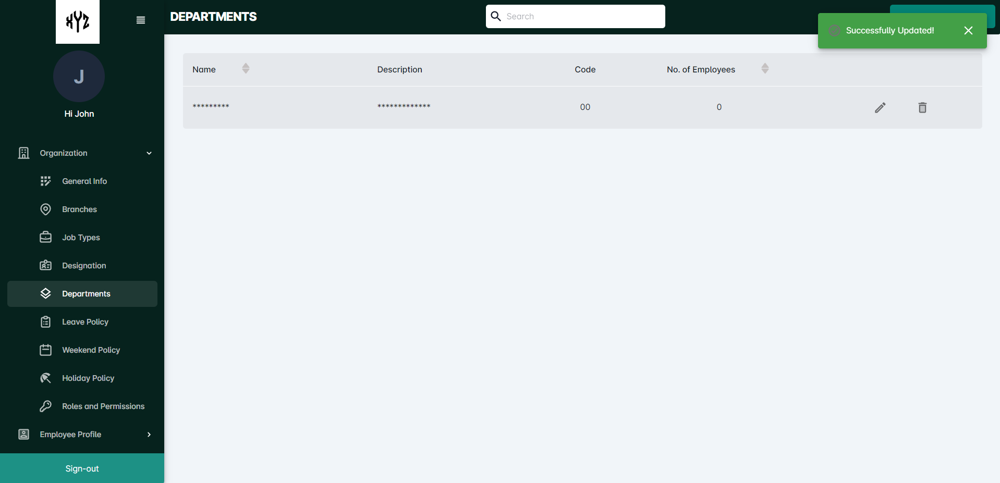

### Leave Policy

This section contains information about the organization's leave policy, including details about different types of leave, such as sick leave, casual leave, and earned leave. It also includes information about the duration and frequency of leave, as well as any eligibility requirements.

Users can customize the **_Leave policy_** according to their needs.

Click on the **_Leave policy _**option to view and add new leave types .

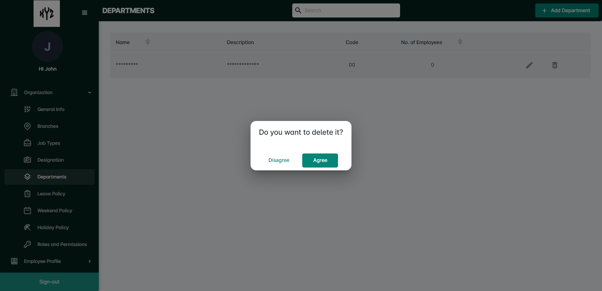

#### To Add LeaveType

Click on the **_+Leave Builder_** to add new leave types. It contains details such as:

**_Basic Information, Levels of Approval, Entitlement, Applicable to_**

##### Basic Information

After clicking on the **_Leave Builder_**, by default the **_Basic information page_** will be displayed.

Enter the details such as: Name of the Leave type, Total no: of Leaves, Leave Description, Maximum and Minimum number of leaves that can be applied at once, whether the Leave visible to employees, Holidays , Optional Holidays and Weekends are inclusive or exclusive etc.

After entering all the details click the **_Next button_** on the bottom right side of the page.

##### Levels of Approval

Levels of approval contains the information of whether the Leave type needs prior approval or not and also the who can approve the Leave when an employee applies it. After selecting the options click Next button on the bottom right side of the page.

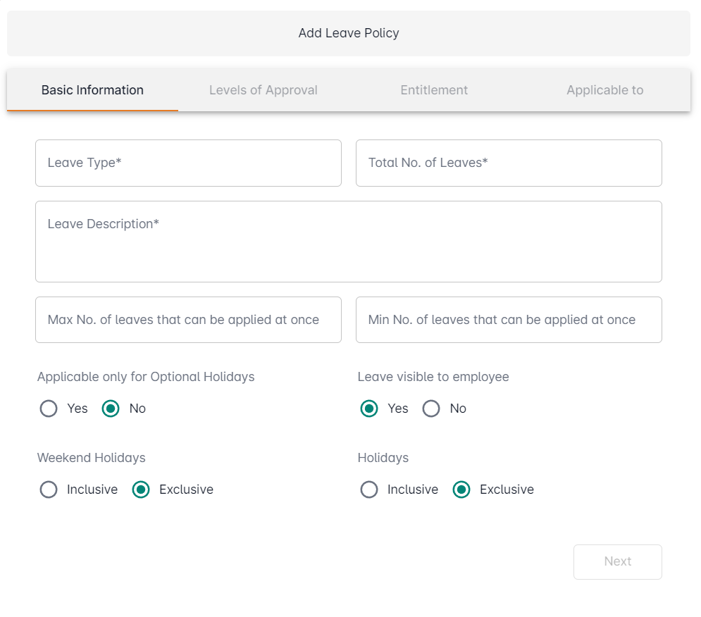

##### Entitlement

In this section, we define how much leave gets credited to an employee using various options such as accrual and reset.

After clicking the**_ Dropdown on the Accrual field yearly option_** will appear. Users can select the Month and Day on the accrual. No: of days will appear automatically after selecting the yearly option. Likewise on the**_ Reset field. _**

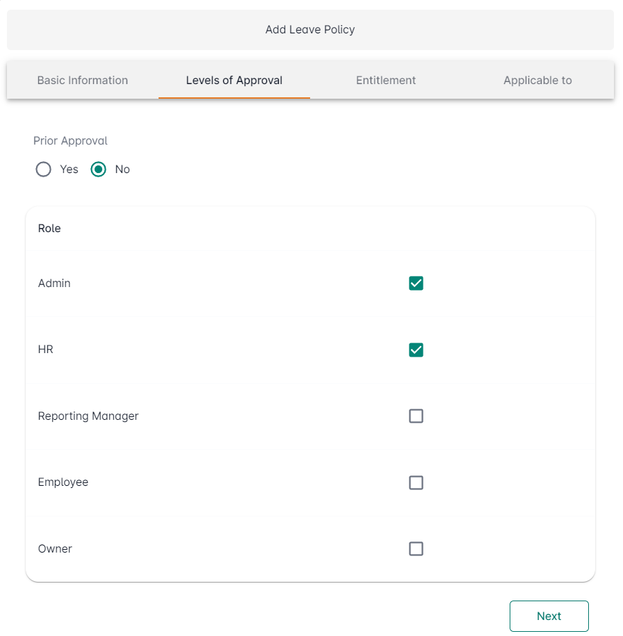

##### Applicable To

In this section, you can define who the leave is 'Applicable' to. You have options like Gender, Marital Status, Department, Designation, Branhh, Role here.

Users can tick on **_Select All Option_** for the **_Branches, Designation, Department, Job Type_** and **_Role_**. If you want to select a particular Branch, Designation, Department, Job type and Role can utilize the **_Search option or the Drop down option. _**

After successfully entering all the details click the **_Submit Button _**on the bottom right side of the page.

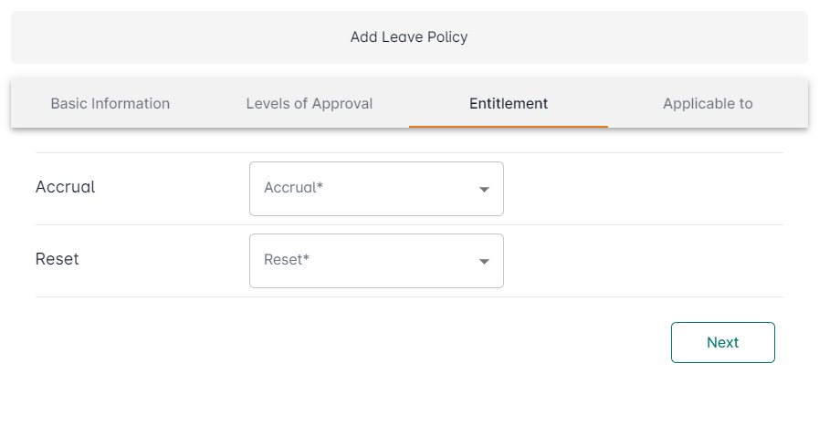

After successfully adding the **_Leave policy_**, it will appear on the page as shown below.

#### To View the Leave policy

Click on a particular **_Leave policy name_** t to view the details. It will appear as shown below.

If the user needs to check a particular **_Leave policy_** he/she can utilize the **_Search Bar_** on the top middle of the page.

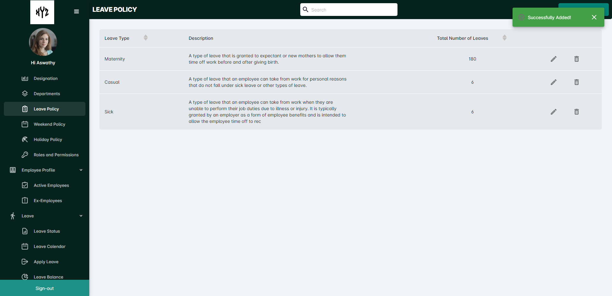

#### To Edit the Leave policy

Click the **_Edit icon_** on the right side of each Leave type to edit the details. It will open a side panel with details enabled to **_edit and submit. _**

#### To Delete the Leave policy

Click on the **_Delete icon_** next to the Edit icon to delete a particular**_ Leave policy_**. It will open a command box.

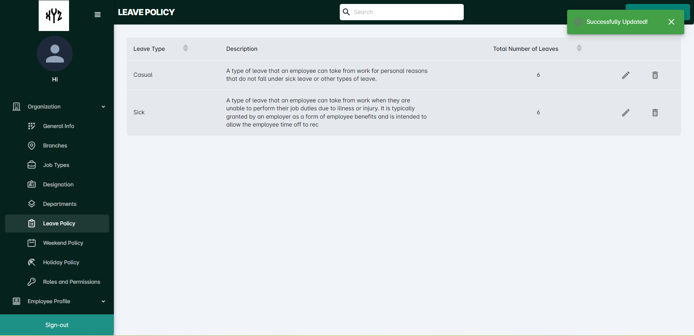

### Weekend Policy

This section contains information about the organization's weekend policy, including details about the number of weekends off, the timing of weekends, and any restrictions or rules related to weekend entitlement.

Click on the **_Weekend Policy_** to view and add Weekends.

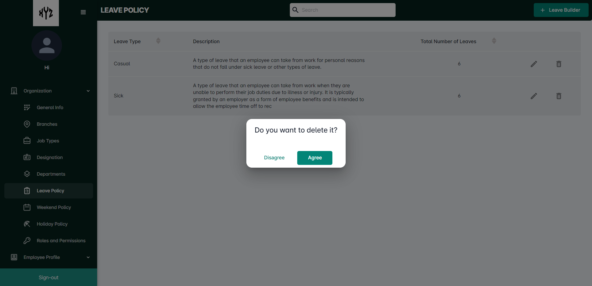

#### Add Weekend policy

Click on the **_+Add Weekend Policy_** option to add new weekends . Enter the details such as: **_Weekend policy name, Type, Weekday, the Branch_** where it is applicable. After entering the details click on the **_Submit button._**

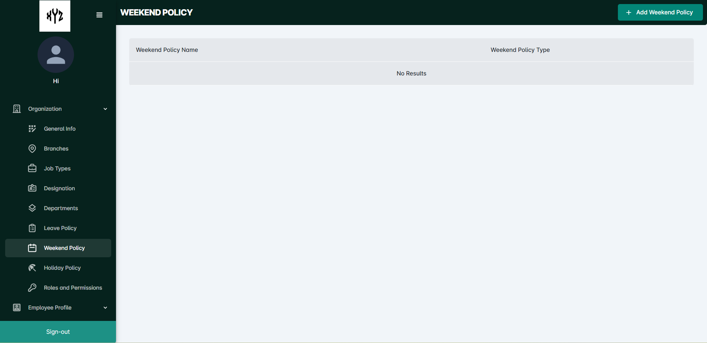

After successfully completing the submission the details will be displayed as shown below.

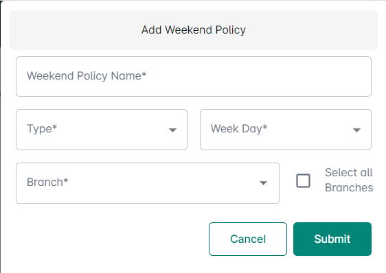

#### View Branches

Click on the **_View Branches _**box on the right side of each **_Weekend type_** to view the details of the branches where it is applicable.

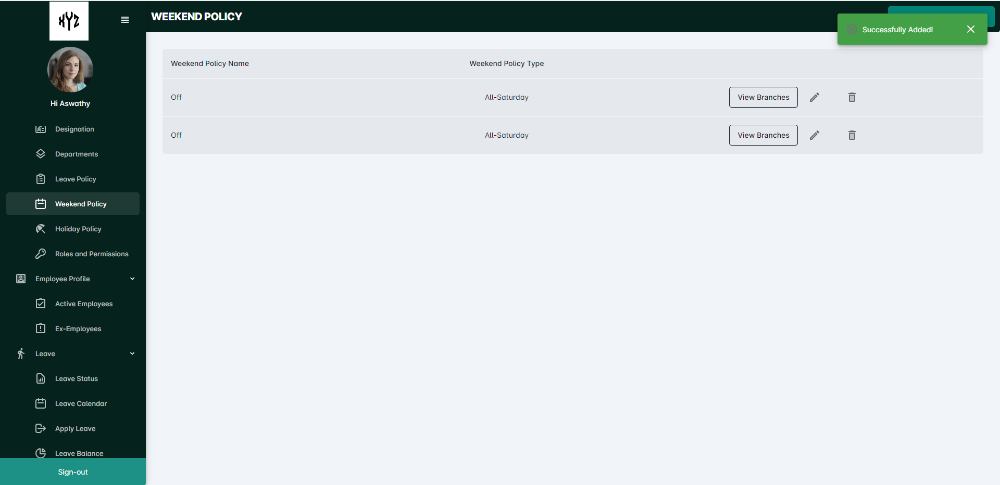

#### View Weekend Policy

Click on a particular **_Weekend policy_** name t to view the details. It will appear as shown below.

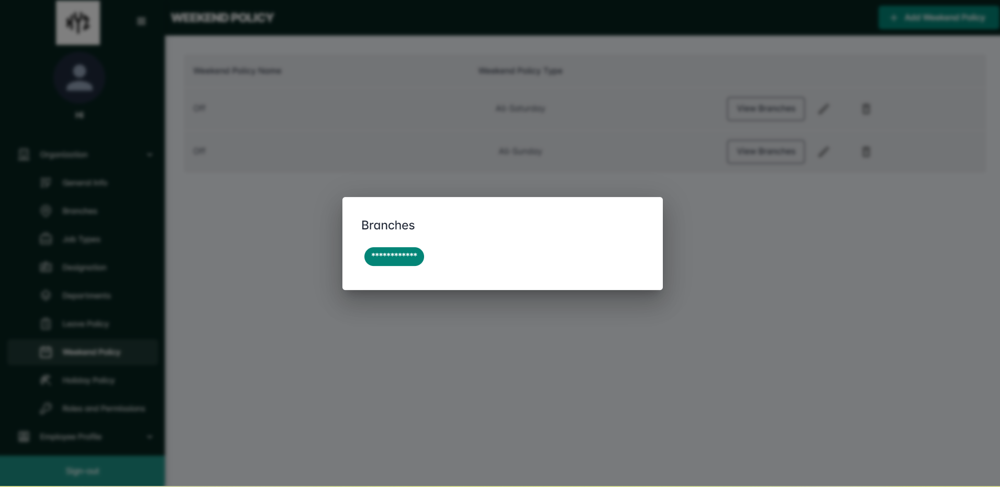

#### Edit Weekend Policy

Click the **_Edit icon _**on the right side of each**_ Weekend Type_** to edit the details. It will open a side panel with details enabled to**_ edit and submit._**

#### Delete Weekend Policy

Click on the **_Delete icon_** next to the Edit icon to delete a particular **_Weekend Policy_**. It will open a command box.

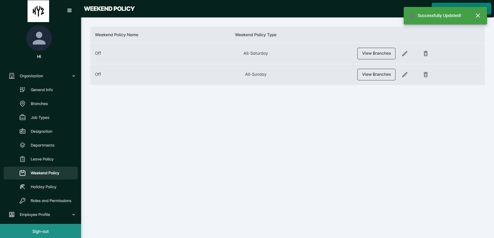

### Holiday Policy

This section contains information about the organization's holiday policy, including details about the type of holidays, number of holidays, the dates of holidays, and any restrictions or rules related to holiday entitlement.

Click on the **_Holiday Policy_** to view and add holidays.

#### Add Holidays

Click on the **_+Add Holiday _**policy option to add new **_Holidays_**. Enter the details such as: **_Holiday name, Date, Type of the Holiday( Whether it is public holiday or optional holiday) , the Branch_** where it is applicable.

After entering the details click on the **_Submit button. _**

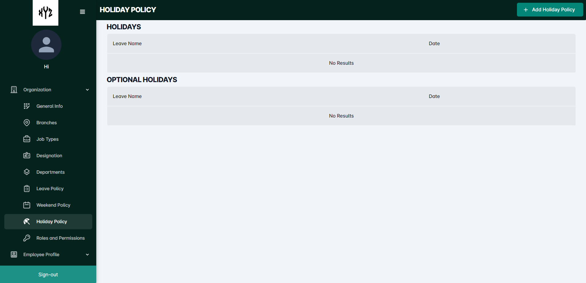

After successfully completing the submission the details will be displayed as shown below.

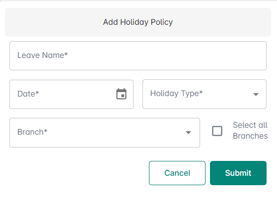

##### View Branches

Click on the **_View Branches_** box on the right side of each **_Holiday type_** to view the details of the branches where the holidays are applicable.

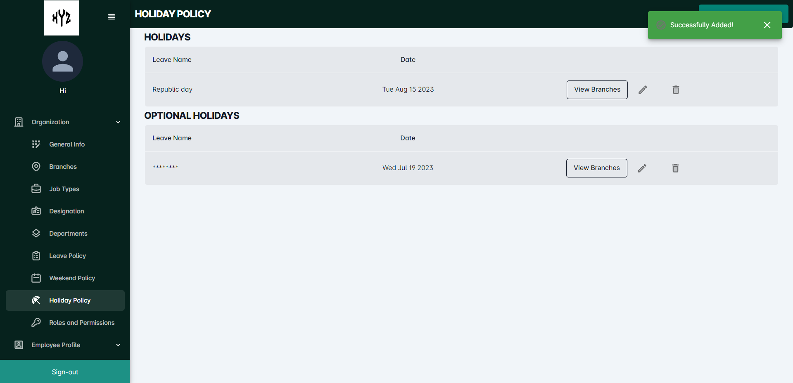

#### View the Holiday details

Click on a particular **_Holiday policy_** name t to view the details. It will appear as shown below.

#### Edit Holiday policy

Click the **_Edit icon_** on the right side of each **_Holiday Type_** to edit the details. It will open a side panel with details enabled to **_edit and submit_**.

#### Delete the Holiday policy

Click on the **_Delete icon _**next to the Edit icon to delete a particular **_Holiday Policy_**. It will open a command box.

### Roles and Permissions

This section contains information about the different roles and permissions within the organization, including details about the access levels and responsibilities of different roles, such as employee, HR, Admin and Reporting Manager.

Click on the **_Roles and Permissions_** option on the side panel. Before setting up roles and permissions in HRMNest, you need to determine what roles are needed within your organization. Reporting managers, HR personnel, Employees and Adim are default roles in HRMNest . Once you have determined the roles, you can move on to setting up permissions for each role.

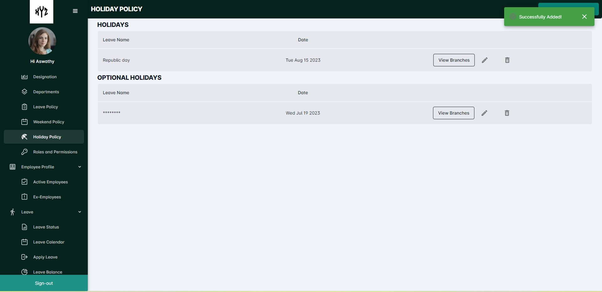

#### Add New Roles

Click on the **_+Add New Role_** on the upper right side of the page. A page shown below will appear. This is where you can add new roles and manage existing ones. Enter the necessary information such as **_Name of the role_** that you would like to create.

After entering the details of the new role, set the role permissions. This is where you can define what actions the user with this role can perform in the system.

Once you have entered all the necessary details and set the permissions, click on the **_Submit button _**to create the new role.

The new role should now appear in the list of roles in the **_Role section._**

If the user needs to check a particular role, he/she can utilize the **_Search bar_** on the upper middle of the page.

#### View Permissions

To view the permissions details entitled to each role click on the**_ View permissions button_** on the right side of each role. A box containing permissions will be displayed.

Users can make use of the Search bar above the box to search for any particular permissions.

## Employee Profile

An employee profile page provides a comprehensive view of a particular employee's information, including their Personal Details , Designation, Branch, Job Type, Role etc.

### Active Employees

Click on the **_Employee Profile_** option in the side panel. A drop down containing **_Active Employees_** and **_Ex-Employees_** will be displayed. Click on the **_Active Employee_** tab.

Admin/ owner have to complete their personal profile to add more employees and to complete the onboarding process in HRMNest. Complete the personal profile by clicking on the **_Edit _**icon on the profile tile. A drawer page will open up.

#### General Info

To complete the General Info, click on the **_Complete your profile_** tile. You can provide all details including Personal Info, Designation, Job Type, Branches, Role etc.

Either users can tick on the **_Auto-generated Employee Id_** column to generate an auto-generated employee Id or manually enter the employee Id. If the users select the **_Auto-generated employee Id_** a pop up will appear on the screen showing the Employee Id.

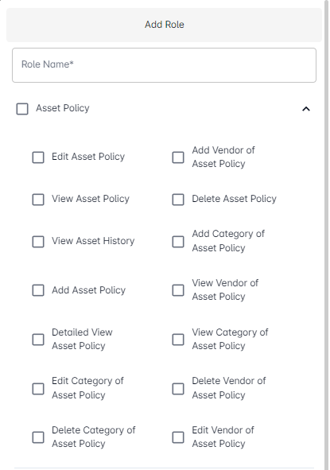

When clicking on the **_Branches, Designation and Department_** option, an already added list of these fields with a **_+ Add_** option will appear. Users can add new **_Branches, Designation, Department_** in this page.

Click on the **_Profile Avatar_** to add a profile photo. If the user needs to change the profile click on the **_Delete icon_** near to the profile avatar.

After entering all mandatory fields click the **_Submit_** button**_._** This will take you to the next section.

#### Professional Info

**_Professional Info_** contains the **_Educational Qualification_** and the **_Past Employment Details._** Users can add more than one professional info by clicking on the **_+symbol_**and can delete the details by clicking on the **_- symbol_**.

Freshers can skip the **_Past Employment Details_** and can **_Submit_** the **_Educational Qualification_** alone.

#### Dependencies

This section provides information about the **_Dependencies_** of the employee and the relationship with them.

It contains the details of the **_Dependent Name, Relationship _**with the dependent and their**_ Date of Birth._** You can add more than one dependency by clicking on the **_+_** icon and can delete it by clicking on the **_-_** icon . Enter the details and click the **_Submit_** button.

#### Documents

The **_Document_** section allows users to store and manage various types of documents related to employee information such as Educational certificates, Employment certificates etc.

Click on the **_Upload Document_** and can submit it from the device. The file size should be less than **_5 MB_**. Users can add more than one **_Document_** by clicking the **_+_** symbol and can remove the document by clicking the **_-_** symbol.

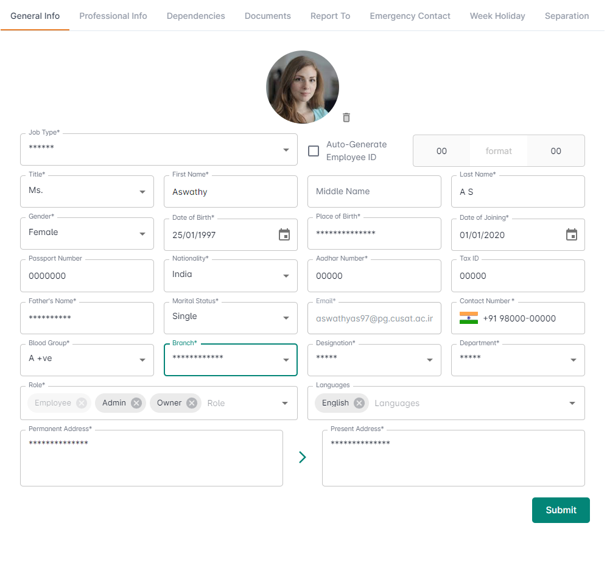

Users need to enter the **_Documents Name_** which is mandatory and click the **_Submit_** button.

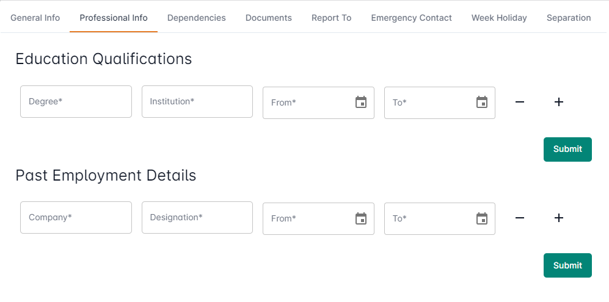

##### Viewing the Document

Click on the **_View Document_** on the right side to view the uploaded document. .

##### Download the Document

Click on the **_Download Document_** button to Download the uploaded documents.

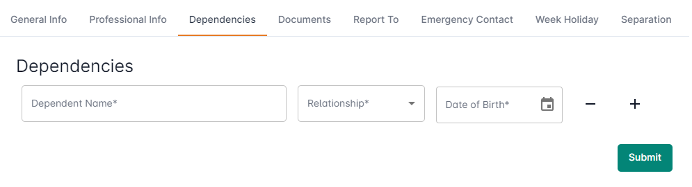

#### Report To

This feature allows users to specify who an employee reports to, who their direct reports are, and the overall structure of the reporting relationships within the organization. The supervisor role has to be defined in the roles and Permissions section.

Click on the **_Drop Down_**on the **_Supervisor_** and **_Subordinate_** fields and select the names. After selecting the names click the **_Submit_** button.

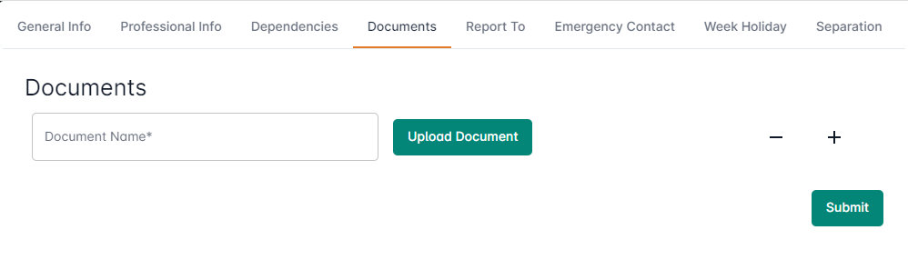

#### Emergency Contact

The **_Emergency Contacts_** section allows employees to provide contact information for individuals who should be notified in case of an emergency.

Enter the **_Contact Name, Phone Number, Relation_** and **_Address_** of the person and click the **_Submit_** button.

Users can add more than one contact by clicking the **_+ icon_** and remove it by clicking the **_- icon_** on the right side of the contact.

#### Weekholiday

This section contains the **_Weekend Holidays_** of the user. Select the **_Weekend Policy_** that is already defined in the **_Roles and Permissions_** sections from the drop down button and click on the **_Submit_** button.

#### Separation

This section contains the separation policy of the organization. It provides a centralized system for HR professionals to handle various types of employee separations, such as terminations, resignations, retirements, or other forms of employment discontinuation. Within the Separation tab, you will find the **_Terminate Employee_** option and a **_Disabled Employee_** option.

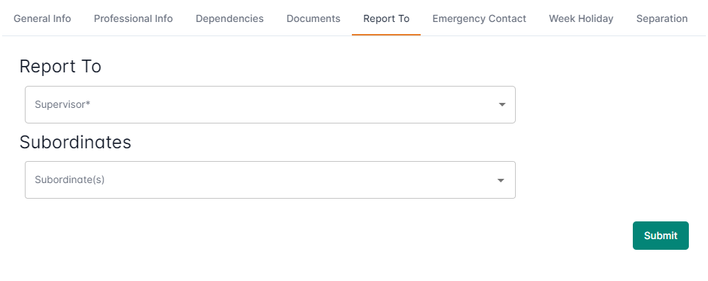

##### Terminate Employee

Select the **_Terminate Employee_** option to initiate the termination process for an employee. Provide a **_reason_** for the termination, which can include voluntary resignation, contract completion, or other applicable reasons from the drop down. Enter the described reason for the termination in the **_Note_** field. Enter the termination **_date_**, which indicates the last working day for the employee.

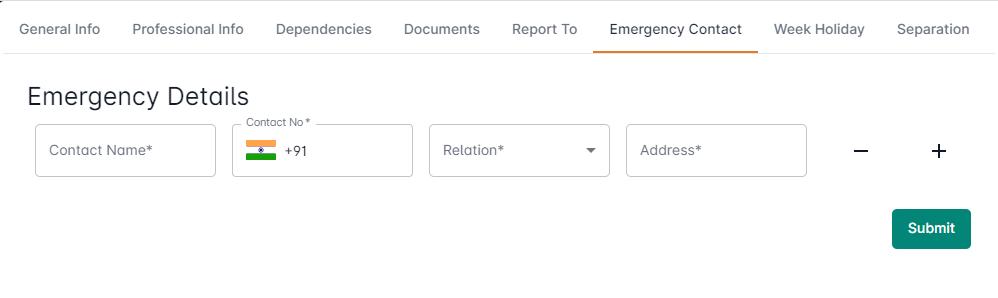

##### Disable Employee

In the **_Separation tab_**, select the **_Disable Employee_** option. The**_ Disable Employee_** feature is typically used when an employee is on a long-term leave, suspension, or when their employment status changes without termination (e.g., change to part-time or temporary status). Provide a reason for disabling the employee in the **_Description_** field.

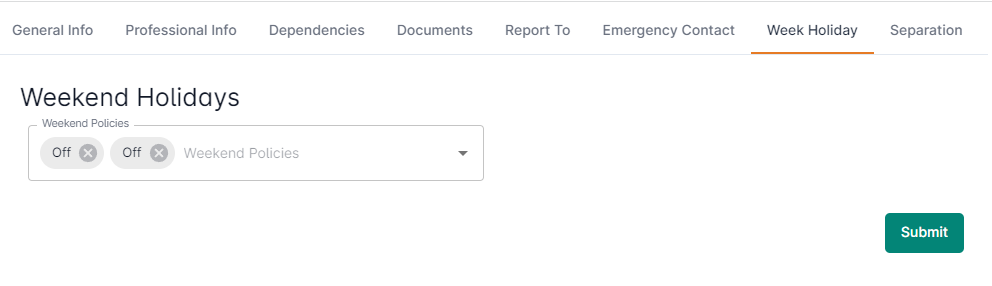

The Employee profile page will look like as shown below after successfully completing the personal profile.

### Add Employee

After successfully completing the personal profile admin can add employees to HRMNest. .

To add more employees to HRMNest, click on the **_+ Add Employee_** option on the upper right side of the page.

A page contains **_General Info, Professional Info, Dependencies, Documents, Report To, Emergency Contact, Week Holidays_** will be displayed. After successful completion of the page click the **_Submit_** button.

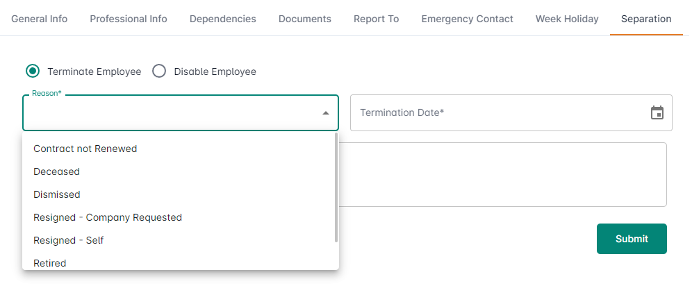

The **_Employee_** Profiles tiles will appear as shown below.

#### Search /Filter

Users can utilize the **_Search Bar_** or the Filter icon above the page to search a particular employee. Users can filter the employees by using the Filter icon on the page. They can filter the employees by **_Departments, Designation, Job Type, Branches and Date of joining_**.

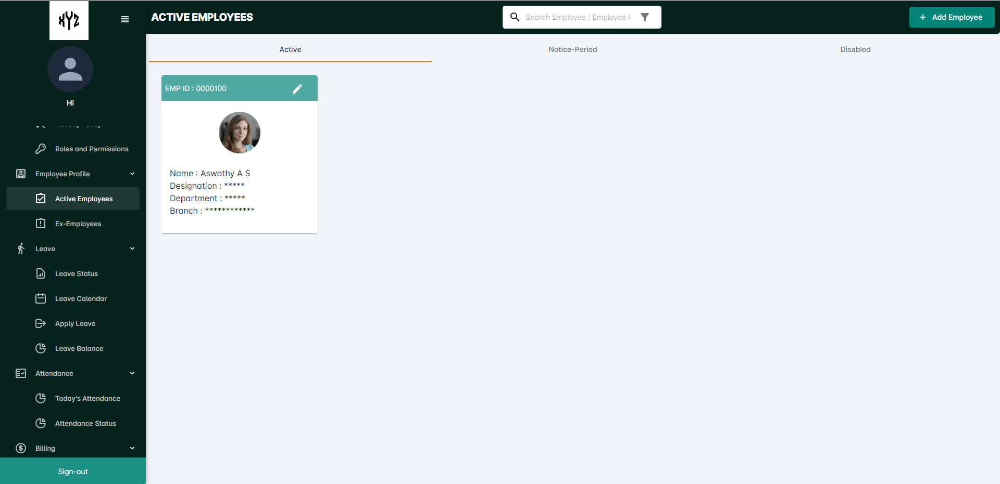

Notice period
Click on the Notice period section which contains the number of employees who are serving their notice period. The Notice Period section allows the admin or HR personnel to set the duration of notice that an employee is required to provide before their termination date in the Terminate Employee section. Select the employee for whom you wish to set the termination status from the list or search option. Click the edit icon and set the employee as terminated in the Separation option.

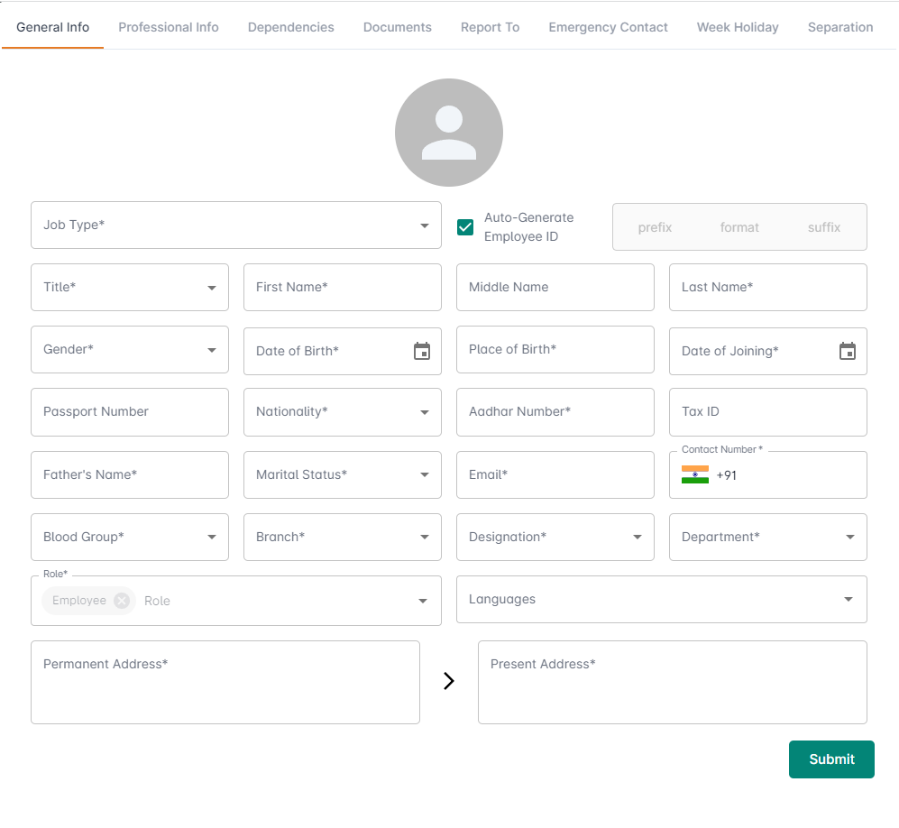

Users can see the status of termination in the **_Separation_** option. Here, the admin can **_Activate the employee_** or **_Disable the employee_** by selecting the respective options.

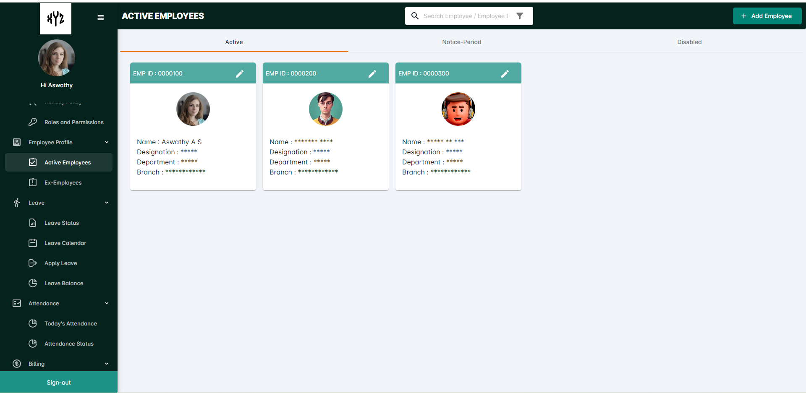

### Disabled

Disabled section allows the admin to manage employees who are temporarily unable to work due to specific circumstances, such as medical leave, extended leaves of absence, or changes in employment status. Select the employee for whom you wish to set the disabled status from the list or search option. Click the **_edit icon_** and set the employee as disabled in the **_Separation_** option.

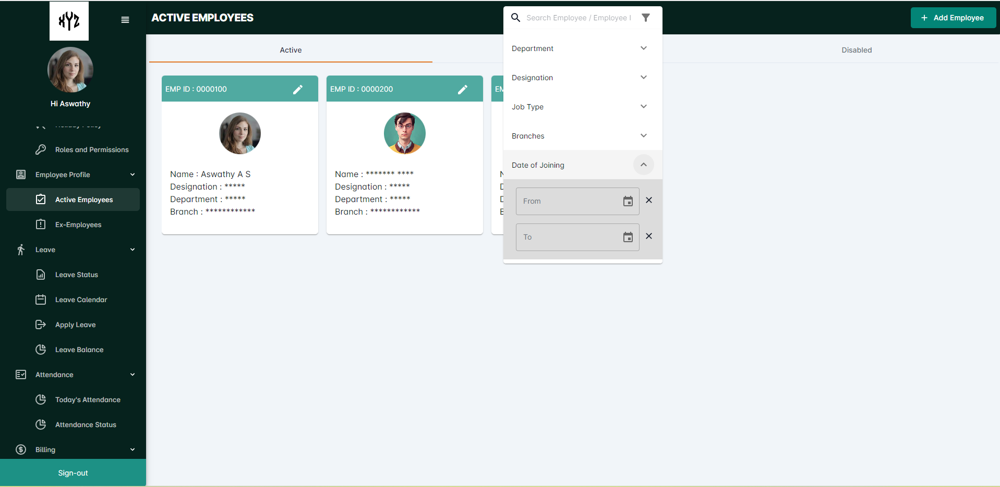

Users can see the status of Disabled in the Separation option. Here, the admin can **_Enable the_** **_employee_** or **_Terminate the employee_** by selecting the respective options.

### Edit Employee Profile

To edit the employee details , click on the **_Edit_** icon on the employee profile tile for whom you wish to edit. A drawer page will open up. After successful editing click the **_Submit_** button.

### Ex-Employees

The **_Ex-Employees_** section allows HR professionals to manage information related to employees who are no longer with the organization. This feature provides a centralized location for storing and managing information related to these former employees. Here, users can see the list of employees who completed their notice period and terminated in the **_Terminate Employee_** section.

## Leaves

The **_Leave_** section allows employees to manage their leaves, and HR professionals to manage employee leave requests, approvals, and balances. This feature provides a centralized location for managing all aspects of employee leave, from requesting time off to tracking available leave balances.

By clicking on the **_Leave_** option a dropdown contains **_Leave Status, Leave Calendar, Apply Leave_** and **_Leave Balance_** will appear. All the Leave details defined in the **_Leave Policy_** section will be available here. This section includes an **_Admin View_** and a **_User View._**

### Admin View

When clicking on the**_ Leave Status_** from the drop down , by default **_Admin View_** will be displayed. Users can utilize the **_Filter_** icon or **_Search_** option to narrow down the view by **_Leave type, Leave status_** or **_Date_**.

#### Leave Status

Once an employee has submitted a leave request through the **_Apply Leave_**, it is added to the **_Leave Status_** list for approval showing as pending. The Admin/HR manager has the ability to take action on leave requests from the **_Leave Status_** page. Clicking on the respective action button (Approve, Reject, Cancel) allow them to update the status of the leave request.

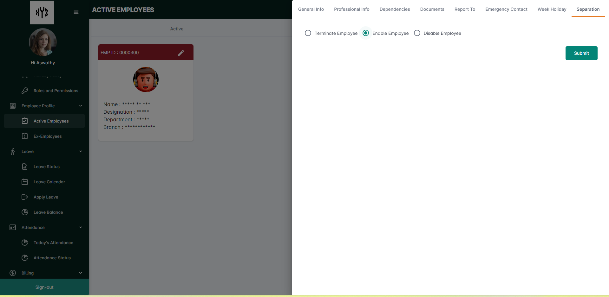

###### **Approve leave requests**

Select the **_Approve_** option from drop down. A pop-up will be displayed asking for approval confirmation.

###### **Reject leave requests**

Select the **_Reject_** option from drop down. A pop-up will be displayed asking for rejection confirmation. You have to give a reason for the rejection.

###### **Cancel leave request**

Select the **_Cancel_** option from drop down. A pop-up will be displayed asking for cancellation confirmation.

#### Leave Calendar

The **_Leave Calendar_** page will display a visual representation of the leave schedule for your organization, typically in a monthly calendar format. It enables efficient leave planning and coordination, ensuring optimal resource allocation and minimizing scheduling conflicts. Users can see different color codes to indicate various leave statuses and leave types. The **_Leave Calendar_** page allows you to navigate between different months by navigation buttons and date pickers to select the desired time frame and view the corresponding leave schedule.

##### **All Employee View**

To view the **_Leave Calendar_** for all employees, select the **_All Employees_** option from the side toolbar. This will display the leave schedule for all employees in the organization. Users can utilize the **_Label_** option to filter the status of the leaves as approved and pending.

##### **Employee View**

To view the **_Leave Calendar_** for a specific employee, select the **_Employee_** option next to **_All Employees_**. A dropdown will appear, allowing you to select the desired employee's name. Choose the employee for whom you want to view the leave schedule, and the calendar will update to display their leave entries. Users can utilize the **_Label_** option to filter the leaves by their type.

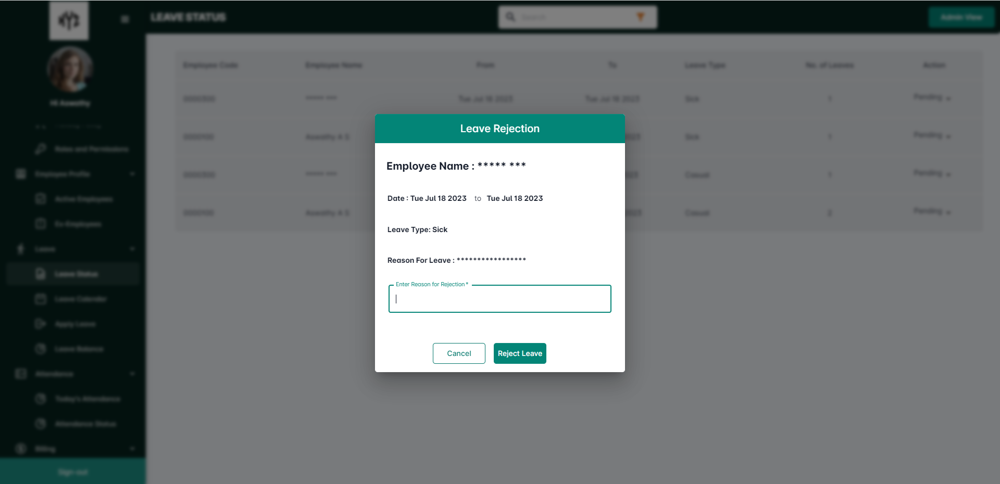

#### Apply Leaves

The admin has the ability to assign leave to an employee on behalf of them. Select the **_Employee Name_** from the drop down**_, Leave Type, From and to Date, Reason_** for the leave if needed ( Not- Mandatory). Click the **_Submit_** button. These leave requests can be view in the **_Leave Status_** option.

#### Leave Balance

The **_Leave Balances_** allows admin or HR managers to quickly and easily view the leave balances of individual employees, as well as the total leave balances across the organization.

Select the **_Name_** of the employee you wish to view the leave balance from the drop down menu.

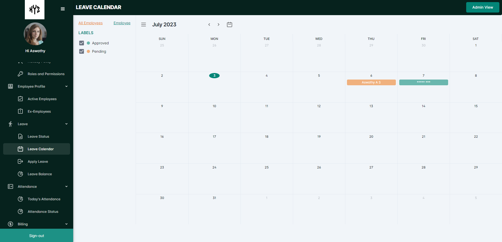

Click the **_View Leaves_** option on the right side of each leave, you can view the leaves and their status taken by that employee.

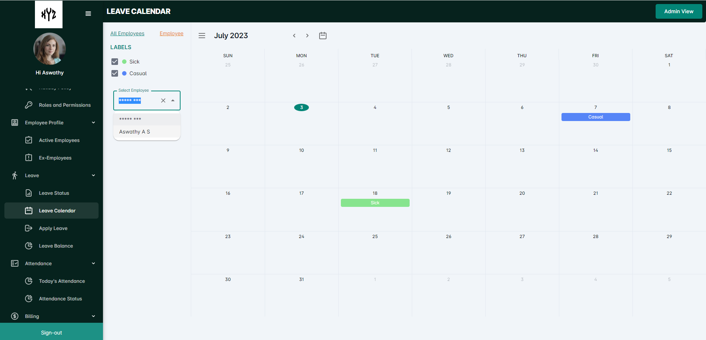

### User View

Switch to **_User View_** function allows an admin or HR manager to switch from the administrative view to the user view. By switching to the user view, the admin or HR manager can see HRMNest from the employee-user view. This allows them to see the same information and interface that the employee sees, which can be useful in troubleshooting any issues or questions that the employee may have.

This section includes **_Leave Status, Apply Leave, Leave Balance_**.

#### Leave Status

Once the employee has submitted a leave request through the **_Apply Leave_**, it is added to the **_Leave Status_** list for approval by an admin or HR manager. The status of each request will be indicated as **_Pending, Approved, Rejected or Canceled_**. Users can utilize the **_Filter_** icon or **_Search_** option to narrow down the view by **_Leave type, Leave status_** or **_Date_**.

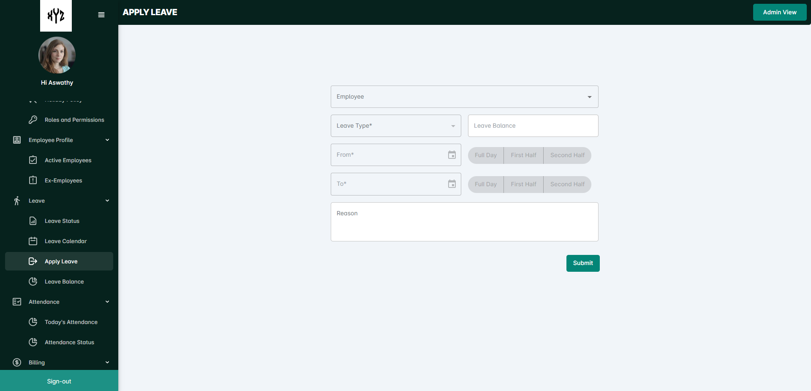

##### **Cancel Leave**

However, if the employee needs to **_Cancel_** their leave for any reason, they can do so by clicking the drop down on the right side of each leave. A Page shown below will be displayed.

A Page shown below will be displayed for asking the cancellation confirmation.

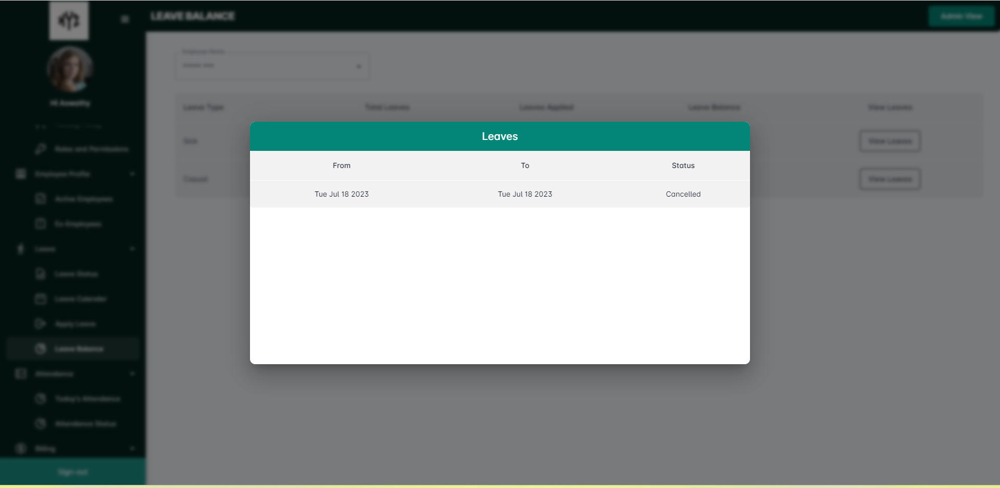

#### Leave Calendar

The **_Leave Calendar_** page will display a visual representation of the leave schedule for the employee, typically in a monthly calendar format. Employees can see different color codes to indicate various leave types. The **_Leave Calendar_** page allows you to navigate between different months by navigation buttons and date pickers to select the desired time frame and view the corresponding leave schedule. Employees can utilize the **_Label_** option to filter the leaves by their type.

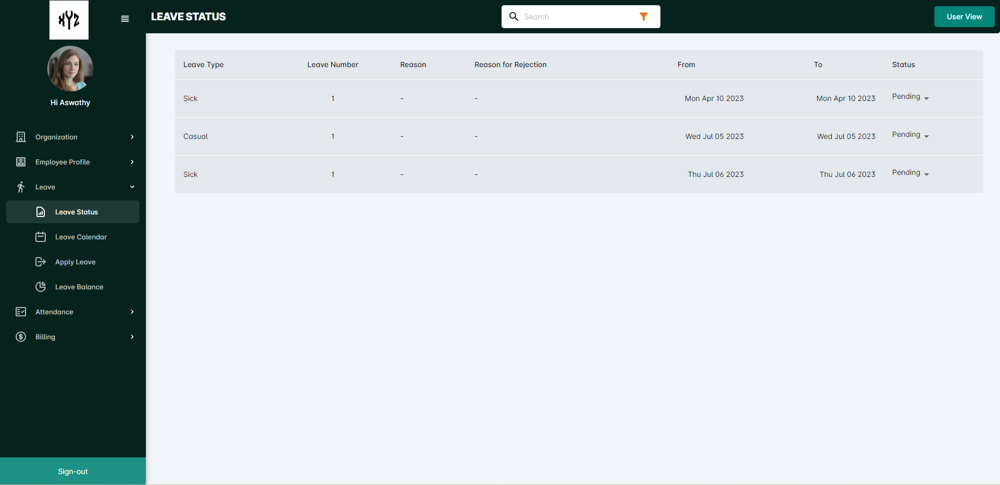

#### Apply Leave

In the user view, the **_Apply Leave_** allows an employee to request time off for a specific period of time, which must be approved by an admin or HR manager. Select the mandatory fields such as, **_Leave Type, From_** and **_To Date, Reason_** for the Leave ( If needed) and click the **_Submit_** button.

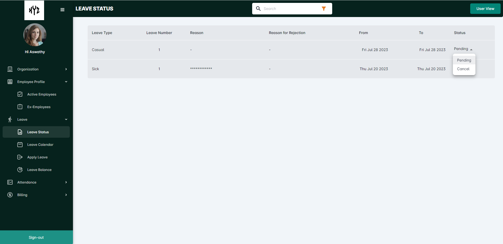

#### Leave Balance

The **_Leave Balance_** section shows the amount of leave remaining for each type for the employees. This information is presented in a clear and easy-to-read format, such as a table. Employees can use the **_Filter_** icon or the **_Search bar_** to view the particular leave types.

Click on the View Leaves option on each **_leave type_**, which allows the user to view the details of the leaves taken by them.

## Attendance

Once the **_Attendance_** feature is enabled, the employee can use it to mark their attendance by checking in when they arrive at work and checking out when they leave. This is  done through the HRMNest attendance mobile app or a web-based interface. HRMNest then records the employee's check-in and check-out times and calculates the total time of work. 

When clicking on the **_Attendance_** option from the side panel, A drop down showing **_Today Attendance_** and **_Attendance Status_**. 

### Today Attendance

By clicking on the **_Today Attendance_** admin or HR manager can see the checkin and checkout time of employees on that particular day. 

### Attendance status

The **_Attendance Status_** page allows you to view the attendance status for a specific date and employee. On the **_Attendance Status_** page, you will find options to choose the desired date for which you want to check the attendance status. Select the specific **_To_** and **_From_** date in the date picker. Additionally, you have the option to select the employee for whom you want to view the attendance status. Choose the employee from a dropdown menu and click the **_Filter_** option on the upper right side of the page. 

The attendance status should indicate the check in and check out time. If the employee has applied for leave on that particular date, the status may also show as **_On Leave_** or **_Unapproved Leave_** to indicate that the leave request is still pending approval.

## Asset Management
 
**_Asset Management_** is a comprehensive feature that allows organizations to effectively manage their assets, including equipment, devices, and other valuable resources. It provides a centralized system to track, organize, and monitor assets throughout their lifecycle, from acquisition to disposal. With Asset Management, Admin/HR Manager can view detailed information about assets, categorize them based on specific criteria, and manage vendor relationships for seamless asset procurement and maintenance. 

By clicking the **_Asset Managemen_**t, a drop down is displayed with **_View Asset, Category_** and **_Vendors_** as options.

### Vendors

The Vendors feature enables users to store and organize information about the various vendors they engage with for HR-related services or products. It serves as a centralized repository to track vendor details, maintain communication records, and ensure efficient vendor management.

Users can make use of the **_Search_** bar to view a particular vendor.

#### Add Vendors

Click on the **_+ Add Vendors_** option on the upper right side of the screen. It will open a side page like below. 

Enter the Vendor Name, Contact Number, Email, Website and Address on the provided fields and enter the **_Submit_** button. 

A notification showing **_Successfully Added_** will be displayed on the upper right of the page. 

#### Edit Vendors

Click on the **_Edit_** icon on the right side of each Vendor. The users will be able to edit the details and can **_Submit_** it. A notification showing **_Successfully Updated_** will be displayed on the upper right of the page. 

#### Delete Vendors

Click on the **_Delete_** icon next to the **_Edit_** icon to delete a particular vendor . It will open a command box to confirm the deletion. 

When you click on **_Agree_**, a notification will be displayed as **_Successfully Deleted_**. 

HRMNest restricts users from deleting vendors who are still in use or associated with active transactions. If you attempt to delete such a vendor, you will receive a notification indicating that the vendor cannot be deleted due to existing dependencies. 

### Category

On the Category page, you can view the list of already defined asset categories.
Each category entry includes details such as category name, total number, instock, assigned, defect, repair, decommissioned and stolen specific to the category.

#### Add Category

Click on the **_+Add Category_** option on the upper right side of the screen. It will open a side page like below. 
 

Enter the **_Category Name_** and **_Series Format_** on the provided fields and enter the **_Submit_** button.

The categories will be listed as shown below.

#### Edit Category

Click on the **_Edit_** icon on the right side of each category. The users will be able to edit the details and can **_Submit_** it. A notification showing **_Successfully Updated_** will be displayed on the upper right of the page. 

#### Delete Category

Click on the **_Delete_** icon next to the **_Edit_** icon to delete a particular Category. It will open a command box to confirm the deletion.       

A notification will be displayed as **_Successfully Deleted_**. 

HRMNets restricts users from deleting categories that are still in use or associated with active items. If you attempt to delete such a category, you will receive a notification indicating that the category cannot be deleted due to existing dependencies.

### View Asset

The **_View Asset_** page will display a list of all the assets registered in the system, including information such as **_Asset ID, Category, Serial number, Model, Status_** and for whom it is **_Assigned to._**

Users can make use of the **_Fiter_** icon to filter out assets according  to category or status.

#### Add Asset

Click on the **_+ Add Asset_** option on the upper right side of the screen. It will open a side page like below. It will contain two options - **_Edit_** **_Asset_** and **_Asset History_**.Select **_Edit Asset_** and give necessary information. Initially, the status of the asset will be shown as  **_In-Stock_**.

Enter the relevant information needed on the provided fields and enter the **_Submit_** button.

A notification showing **_Successfully Added_** will be displayed on the upper right of the page. 

#### Edit Asset

Click on the **_Edit_** icon on the right side of each Asset. Users can change the status of the asset as **_In-stock, Assign, Defect, Repair, Stolen_** and **_Decommission_** from the drop down. The users will be able to edit the details and can **_Submit_** it.  A notification showing **_Successfully Updated_** will be displayed on the upper right side of the page. 

##### Assigned Asset

Admin/HR manager can assign a particular asset to an employee by changing the status of the asset by editing the asset. Select the **_Assign_** option from the drop down. A new set of fields will appear below the **_Status_** field. Give details on  name of the employee whom it is assigned to, Employee ID, Assigned Date and click the Submit button. 

Admin/ HR manager can change the status of a defected asset as **_Defect_** by editing the particular asset. Select the **_Defect_** option from the drop down. A new set of fields will appear below the **_Status_** field. Give details on whether it is assigned to an employee or a branch. If it is assigned to an employee, select the name of the employee and the defected date. If it is assigned to a particular branch, select the name of the branch and the defected date.

Users can change the status of the defected item , if  it returned to the vendor by selecting the Return option from the drop down and giving the returned date. 

##### Stolen Asset

Admin/ HR manager can change the status of an asset which is stolen by editing the asset. Select the **_Stolen_** option from drop down. A new field for entering the stolen date will appear below the **_Status_** field. Give the stolen date.

Users can change the status, if the stolen asset is found. Select the **_Found_** option from the drop down and give the date which is found on. 

##### Repair Asset

Admin/HR manager can change the status of an asset which is in repair by selecting the **_Repair_** option from the drop down. A new set of fields will appear below the **_Status_** field. Give details on whether it is assigned to an employee, branch or a vendor for repair.  Select the employee, branch or vendor name from the drop down, repair assigned date and expected return date. 

If the repaired item is returned, users can change status as returned from the drop down. 

##### Decommissioned Asset

Admin/HR manager can change the status of the assets that are no longer in active use or operation within an organization by selecting the Decommissioned option from drop down. A new field for entering the decommissioned date will appear below the **_Status_** field. 

The reusing or repurposing assets that were previously marked as decommissioned can change the status as Make available.

### Asset History

**_Asset History_** option provides a comprehensive record of events, actions, and changes that have occurred over time for each asset. This feature enables efficient asset management, facilitates decision-making, and ensures compliance with asset-related policies and regulations. 

To view the **_Asset History_** click on the **_Edit_** icon on the right of each asset. Select the **_Asset History_** option next to **_Edit Asse_**t. The asset history will typically display a chronological list of significant events or actions related to the asset.

## Billing

The **_Billing_** feature enables organizations to manage their subscription plans and billing details effectively. It offers different plans catering to varying needs and requirements. With the Billing feature, users can select a suitable plan, update billing information, and manage subscriptions seamlessly. 

Within the **_Billing_** section, you will find information about the available plans. The plans typically include **_Start Up, Business_** and **_Enterprise_**, each offering different features and pricing options. Familiarize yourself with the features and pricing details of each plan to make an informed decision.

### Overview

By clicking the Billing option a drop down showing Overview, Invoice and Payment Method will be displayed. The **_Overview_** option within the **_Billing_** section provides a comprehensive overview of your organization's billing details and subscription information. 

**_Subscription Effective Date_**: The subscription effective date refers to the date when the subscription plan became active and commenced its services.

**_Status_**: The status indicates the current state of the subscription, whether it is Active, Past Due, Paused or Trial. 

**_Billing Cycle:_** The billing cycle refers to the specific time period for which the subscription charges are calculated. It can be monthly or yearly. .

**_Next Renewal Date:_** The next renewal date denotes the date on which the subscription will automatically renew if not canceled by the user before that date.

**_Next Invoice Due:_** The next invoice due date signifies the deadline by which the user needs to make the payment for the upcoming billing cycle.

**_Next Invoice Amount:_** The next invoice amount displays the total amount that the user needs to pay for the next billing cycle. It will depend on the number of employees added to the HRMNest.

If the user needs to reduce or increase the number of employees, they can do so by selecting the **_Change plan_** option on the upper left side of the screen.

Reduce or increase the number of employees by clicking on the + or - icon in the **_Business_** plan and click **_Select_** button. It will show the overview page with a notification showing **_Plan Updated_**.

If they want to cancel the new updates  click on the Cancel button on the **_Upcoming Updates_** page. 

Here, The number of employees is reduced and the **_Invoice Amount_** is also reduced. The balance paid will be kept in the HRMNest account and can be used in the next payment.



Here, the number of employees is increased and it will lead to a payment portal where the user needs to pay for the increased  number of employees. They can make the payment by clicking the **_Confirm Payment_** button. The amount will be deducted from the already added card. If the user wants to change the payment method, click on the **_Select a new payment method _** on the bottom line of the page. 

If the user wants to know the detailed view of the payment,  click on the **_View invoice and payment details _**option on the page. A detailed view of the payment page will be displayed on the right side of the same screen. If the user has any queries they can contact the HRMNest Support team by clicking on the **_Contact hrm_** option on the bottom line of the page.

**_Preferred Payment Method:_** The preferred payment method indicates the user's chosen mode of payment for the subscription: Credit car, Debit card, Invoice payment etc. 

**_Billing Email:_** The billing email is the designated email address to which all billing-related communications and invoices are sent. If the user wants to change the email address, click the **_Change Email_** option. A pop-up displayed asking for a new email address. Enter the email address and click the **_Submi_**t button. 

#### Trial option 

As a new user, you are eligible for a **_60-day trial_** period to explore the HRMNest’s full features and capabilities. During this trial period, you have complete access to all features of the software.

You can use HRMNest without providing any payment information or credit card details. Take note of the trial end date to ensure timely decision-making regarding the subscription plan. The billing information for the plan can be viewed in the**_ Invoice_** section. You can make the payment at any time during this 60 day trial through the **_Invoice_** section. 

If you choose not to pay for a subscription plan after the trial period ends, your plan will automatically be changed to the **_Start Up plan_**. 

#### Start Up Plan

The Basic plan typically provides free access for up to 10 employees and the rest of the employee details will be locked in the **_Disabled_** employee section. Basic plans have limited features compared to paid plans. If you wish to access additional features or expand the number of employees beyond the **_StartUp Plan's_** limitations, you can upgrade to a higher plan at any time. 

#### Business Plan

If the Basic plan does not meet your organization's requirements, you have the option to upgrade to a higher plan. Click on the **_Upgrade_** or **_Change Plan_** button associated with the desired plan, such as **_Business_** or **_Enterprise_**. Review the features and pricing details of the higher plan before proceeding. For choosing the Business plan, give the number of employees you wish to add in the HRMNest by clicking the + icon and click **_Select._** You can select a monthly plan or the yearly plan. 

It will lead to a page shown below. 

Click the Proceed to Checkout button. It will redirect to a payment gateway shown below. 

Once you have finished managing your subscription the plan details will be displayed on the **_Overview_** page as shown below. It will include the following information: Subscription date, Current status, Invoice details, Employee license number

#### Enterprise Plan

The Billing section allows users to explore and upgrade to the Enterprise plan, which offers advanced customization options tailored to your organization's specific needs. If the Enterprise plan aligns with your requirements, click on the corresponding **_Contact Us_** button.

HRMNest will redirect you to a page with contact information. This page will provide details on how to get in touch with HRMNest for further assistance regarding the Enterprise plan and its customization options. Once you contact HRMNest, our support team will guide you through the process of customizing the **_Enterprise_** plan to suit your organization's specific needs. They will provide you with detailed information on features, pricing, and implementation timelines.

### Invoice

The Invoice section in the HRMNest provides users with a comprehensive overview of invoices, displaying essential details such as invoice numbers, issue dates, due dates, and total amounts. On the Invoice page, you will find a list of your past invoices. Each invoice will typically include details such as the invoice number, Issue and payment date, amount and current status. 

Clicking on the **_Eye_icon_** users will redirect to the detailed payment page where you can download the receipt as well as the invoice. 

The **_Download arrow_** on the right side of the page will allow you to download the invoice in a PDF format. 

### Payment Methods

The Payment Methods feature in HRMNest provides users with flexible options to make payments for their subscriptions. It allows users to choose the most convenient and secure payment method that suits their needs.

Either the user can opt for **_Card payment_** or **_Invoice payment._** 

#### Card payment

Select the **_+Add Cards_** option for adding a new card. Enter the required card details, such as card number, expiration date, and security code. Provide the billing address associated with the card for verification purposes. Review the entered information to ensure accuracy.

Click the **_Submit_** button and set it as the default payment method if desired. The saved card will be shown in the Payment Method option. 

#### Invoice Payment

Select the Switch to Invoice Payment option on the upper right side of the page and click on it. 

A pop-up asking for confirmation will be displayed.

Click on the **_Agree_** button. Upon selecting the invoice payment method, invoices will be generated for the subscriptions. Follow the provided instructions on the generated invoice to complete the payment process. This involves making a bank transfer or initiating the payment through other specified means.

