# Dashboard

On successful login, a user is directed to the **_Dashboard_** which consists of the main menu on the left side. It consists of **_Organizational information, Employee profile, Leave details and Attendance._**

If the user signs up for the first time he/she will get the **_Admin role._**

Below shown screen will be displayed. The browser pop ups may appear if the user is getting logged on to the portal for the first time, users can save the credentials on the browser.

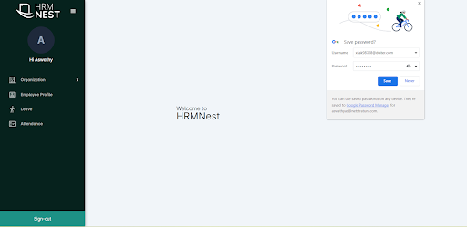

Click on the **_Three horizontal line symbols_** on the side panel will provide you a wide view of the the page

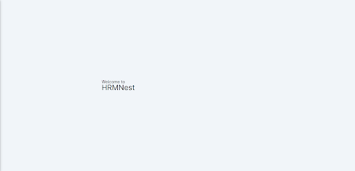

## Organization

The **_Organization section_** serves the purpose of maintaining and managing company details, policies and procedures. This section offers various features and tools that are specifically designed to assist HR managers and administrators in managing the workforce efficiently. The key elements of this section include: **_General info, Branches Job Type, Designation, Departments, Leave policy, Weekend policy, Holiday policy, Roles and permissions. _**

Click on the **_Organization _**on the left panel. A user(Admin) will be allowed to add more employees only after completing the **_Organization information._**

### General Info

The **_General info_** page provides basic information about the company using HRMNest. It includes the company name, website, and contact address.

Click on the **_General Info_** under the **_Organization module_**. A page will appear shown below.

Enter the **_Company name, Company Address and Company website link_** in corresponding fields. Users can upload the company logo by clicking on the**_ Upload company logo _**option. After completing the fields click on the **_Submit button._** The logo will be displayed on the side panel as well as the upload logo field.

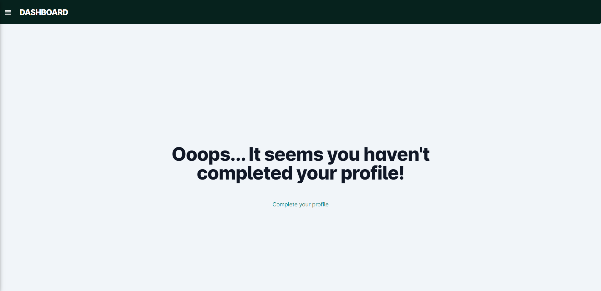

#### Enable attendance app

Users can tick on the**_ Enable attendance app_** check box if the organization wants to align the employee**\_ \_**check in and check out with HRMNest.

### Branches

This section contains information about the different branches or locations of the organization, including contact details, addresses, and other relevant information.

Click on the **_Branches_** option to add and view branches.

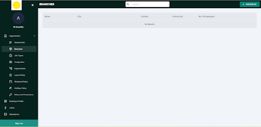

#### Add Branches

Click on the **_+Add Branch icon_** on the upper right side of the page to add new branches. A page like below will appear.

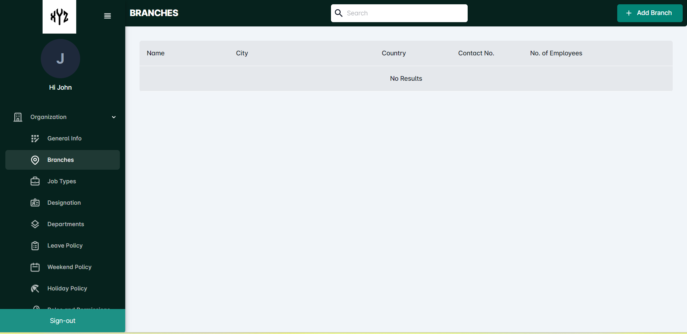

Enter the mandatory details and click on the **_Submit button_**. Users can discard the details by clicking the **_Cancel option._**

After successful addition of a new branch to HRMNest, it will appear as shown below.

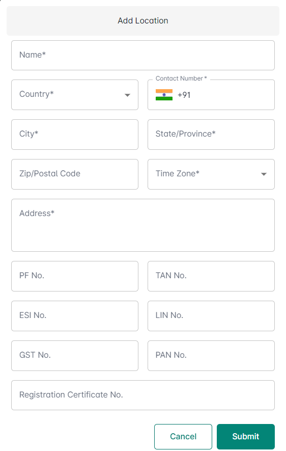

#### To view the branch details

Click on the **_Branch name_**to view the branch details. It will appear as shown below.

If the user needs to check a particular branch, he/she can utilize the search option on the top middle of the page.

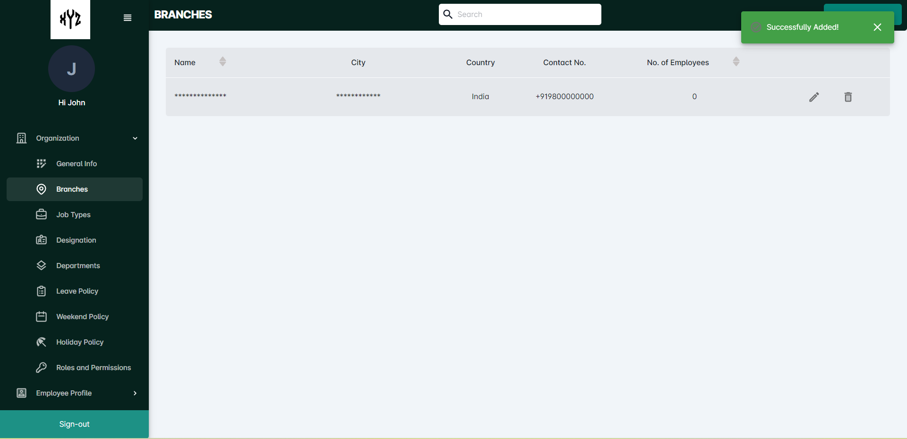

#### To Edit the Branch details

Click on the**_ Edit icon_** on the right side of each branch. The users will be able to edit the details and can **_Submit _**it. A notification showing **_Successfully Updated_** will be displayed on the upper right of the page.

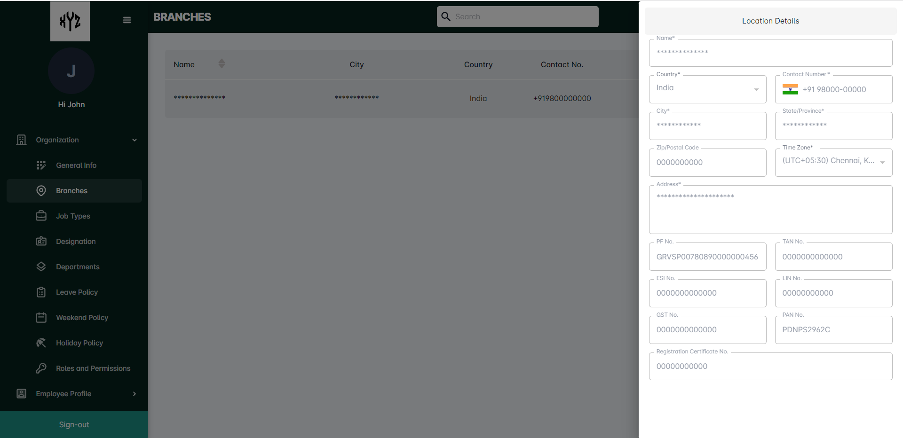

#### To Delete the Branch

Click on the **_Delete icon_** on the right side of each branch. A dialog box will appear asking for the command.

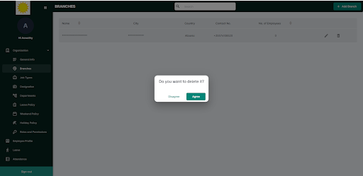

### Job Type

This section contains information about different job types and positions within the organization, such as full-time, part-time, contractual, or permanent positions.

Click on the **_Job Type _**option to view and add Job types

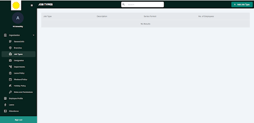

#### To add Job Type

Click on the **_+Add job Type_** option on the upper right side of the screen. It will open a side page like below.

Enter the **_Job type, Description, and the Series format_** ( Prefix and suffix is not mandatory) on the provided fields and enter the **_Submit button. _**

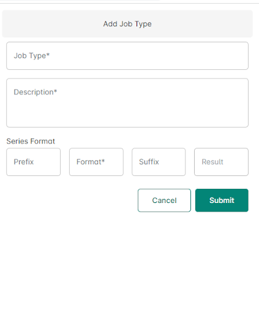

After successful addition of a job type it will be displayed as shown below.

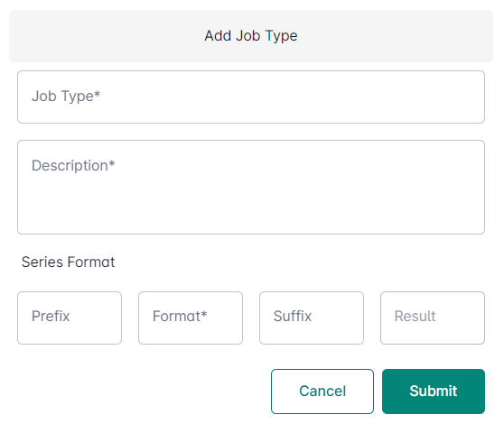

#### To view the Details

Click on the name of the particular**_ Job type _**to view the details. It will display as shown below.

If the user needs to check a particular job type details he/she can utilize the **_Search option_** on the top middle of the page.

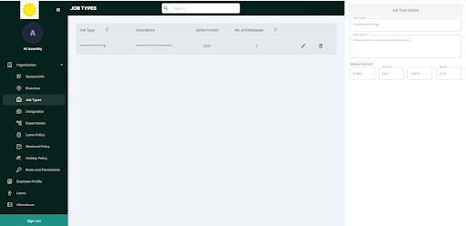

#### To Edit the details

Click on the **_Edit icon_** on the right side of each job type to edit the details. After editing, click on the **_Submit button._**

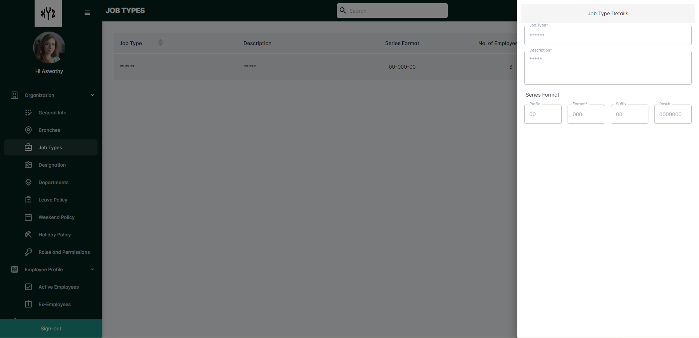

#### To Delete the Job type

Click on the**_ Delete icon_** next to the edit icon on the same page. It will open a command box as shown below.

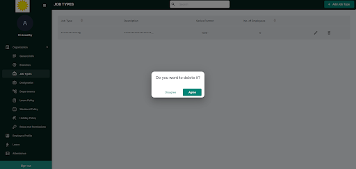

### Designation

This section includes information about the designation of different positions, such as Manager, Executive, or Supervisor.

Click on the **_Designation_** option in the sidebar to view and add Designations.

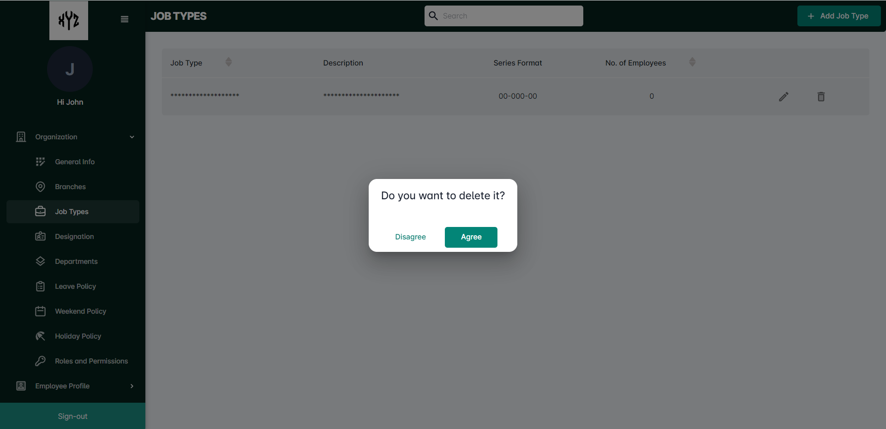

#### To Add a Designation

Click on the **_+Add Designation_** button on the upper right side of the page. A Side panel will open like shown below.

Enter the **_Designation name, Description and Code_**( Not Mandatory) on corresponding fields and click the **_Submit button. _**

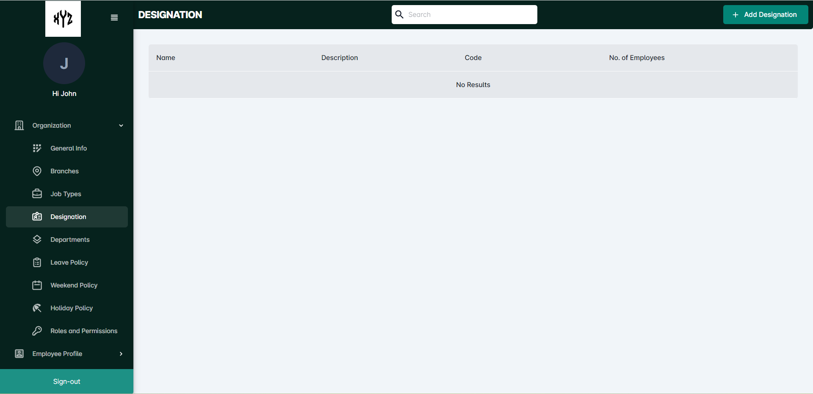

After successful addition of the **_Designation _**it will be displayed on the page as shown below.

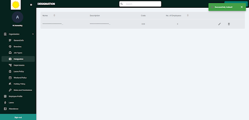

#### To View the Details

Click on a particular name of the **_Designation_** to view the details. It will appear as shown below.

If the user needs to check a particular**_ Designation_** he/she can utilize the **_Search Bar_** on the top middle of the page.

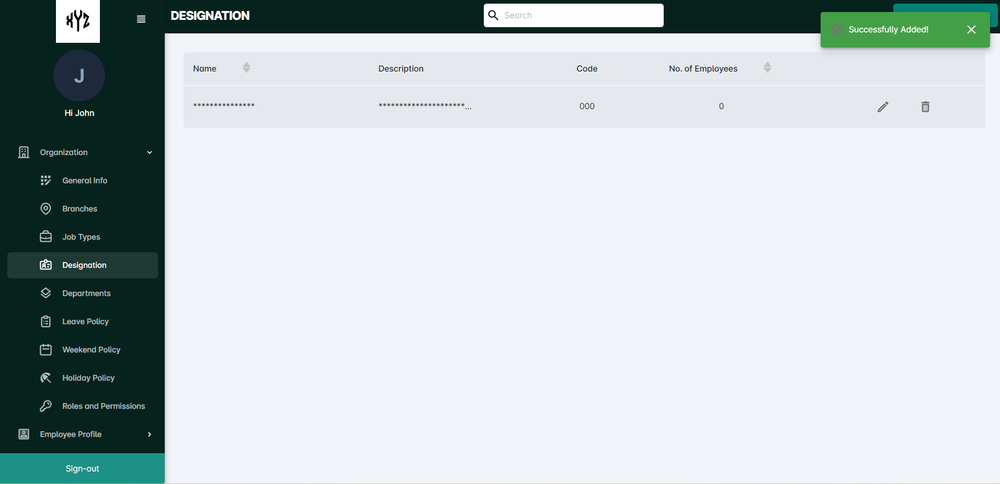

#### To Edit the Details

Click on the **_Edit icon_** on the right side of each Designation to edit the details. It will open a side panel with details enabled to edit and submit.

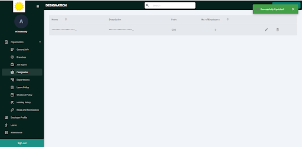

#### To Delete the Designation

Click on the **_Delete icon _**next to the Edit icon to delete a particular Designation. It will open a command box.

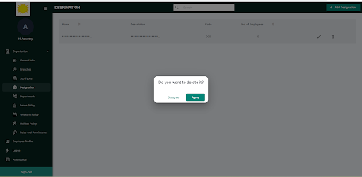

### Departments

This section contains information about different departments within the organization, such as Sales, Marketing, Finance, or Human Resources.

Click on the **_Department option_** in the sidebar to view and add Departments.

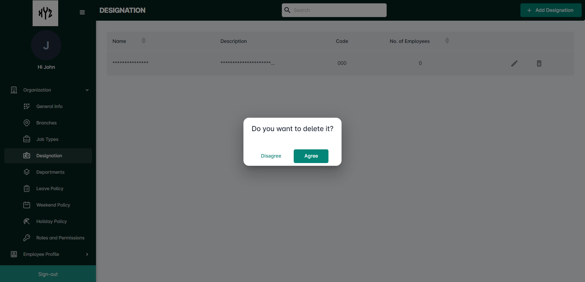

#### To Add Departments

Click on the **_+AddDepartment_** button on the upper right side of the page. A Side panel will open like shown below.

Enter the **_Department name , Description and Code_** ( Not Mandatory) on corresponding fields and click the**_ Submit button. _**

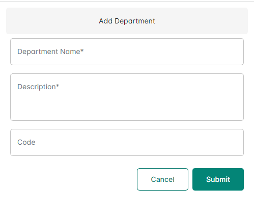

After successful addition of the **_Department_** it will be displayed on the page as shown below.

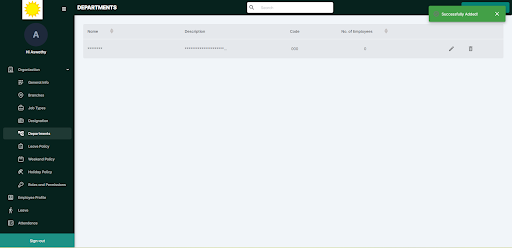

#### To View the Details

Click on a particular name of the Department to view the details. It will appear as shown below.

If the user needs to check a particular **_Department _**he/she can utilize the**_ Search Bar_** on the top middle of the page.

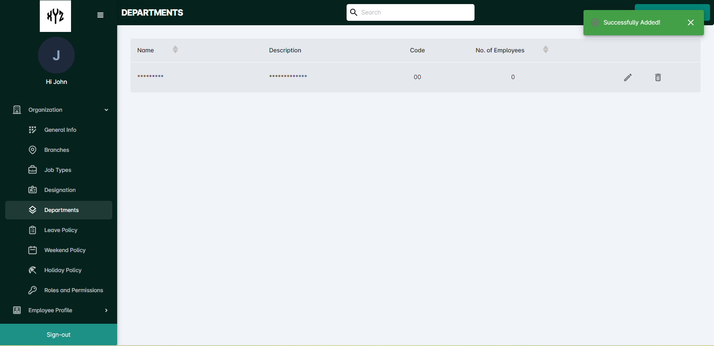

#### To Edit the Details

Click on the Edit icon on the right side of each **_Department _**to edit the details. It will open a side panel with details enabled to **_edit and submit_**.

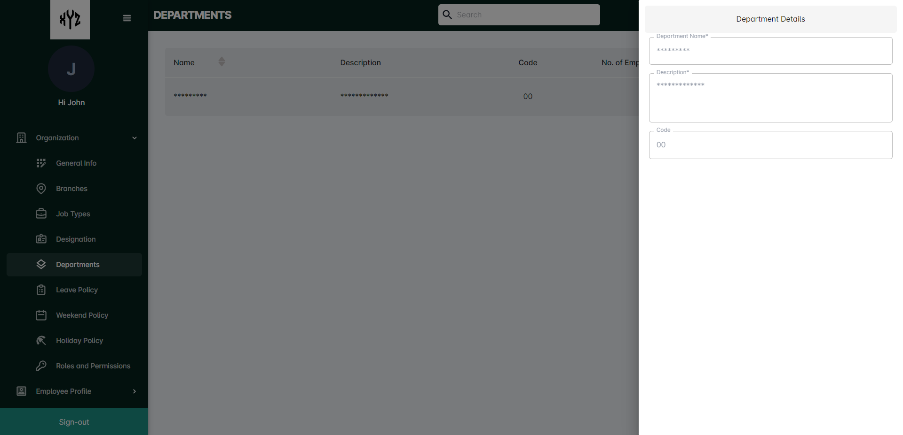

#### To Delete the Department

Click on the **_Delete icon_** next to the Edit icon to delete a particular Department. It will open a command box.

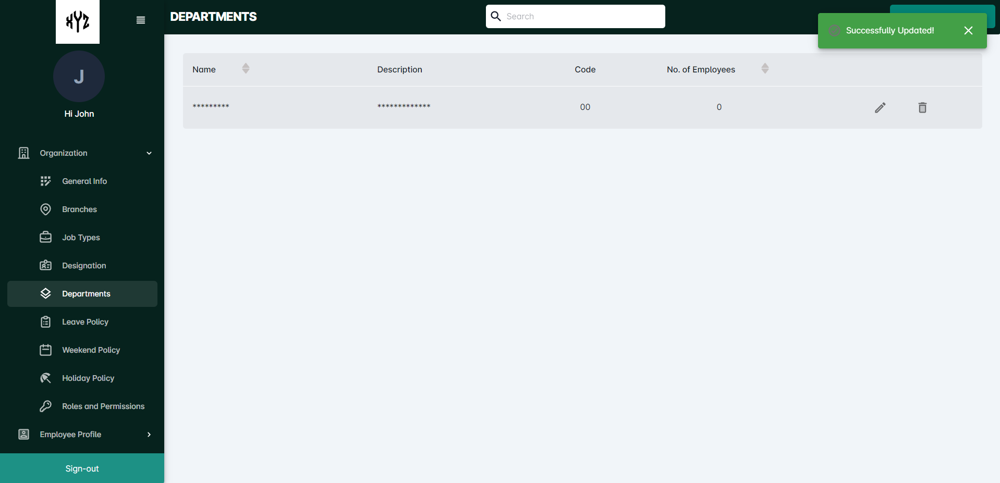

### Leave Policy

This section contains information about the organization's leave policy, including details about different types of leave, such as sick leave, casual leave, and earned leave. It also includes information about the duration and frequency of leave, as well as any eligibility requirements.

Users can customize the **_Leave policy_** according to their needs.

Click on the **_Leave policy _**option to view and add new leave types .

#### To Add LeaveType

Click on the **_+Leave Builder_** to add new leave types. It contains details such as:

**_Basic Information, Levels of Approval, Entitlement, Applicable to_**

##### Basic Information

After clicking on the **_Leave Builder_**, by default the **_Basic information page_** will be displayed.

Enter the details such as: Name of the Leave type, Total no: of Leaves, Leave Description, Maximum and Minimum number of leaves that can be applied at once, whether the Leave visible to employees, Holidays , Optional Holidays and Weekends are inclusive or exclusive etc.

After entering all the details click the **_Next button_** on the bottom right side of the page.

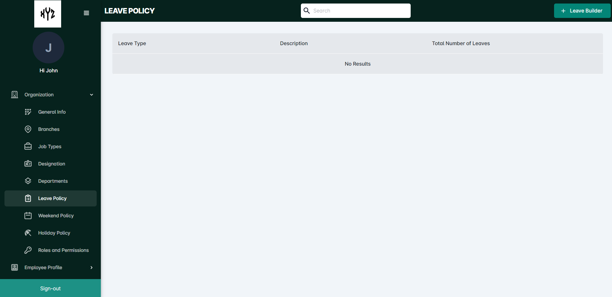

##### Levels of Approval

Levels of approval contains the information of whether the Leave type needs prior approval or not and also the who can approve the Leave when an employee applies it. After selecting the options click Next button on the bottom right side of the page.

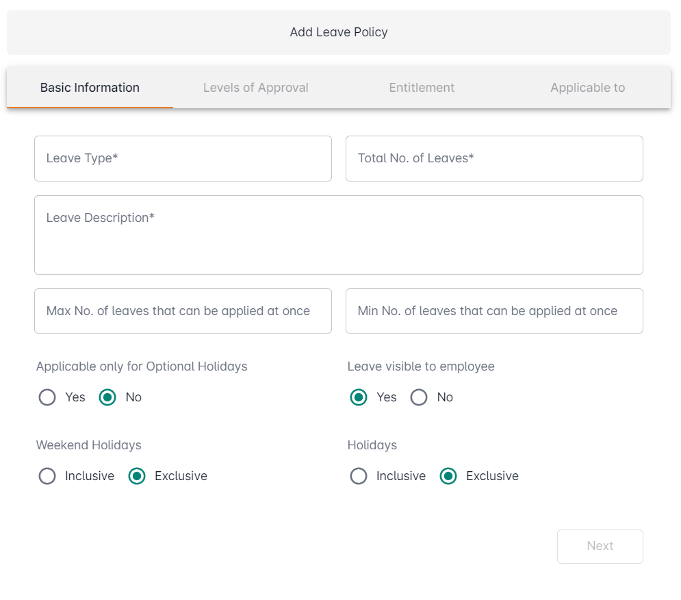

##### Entitlement

In this section, we define how much leave gets credited to an employee using various options such as accrual and reset.

After clicking the**_ Dropdown on the Accrual field yearly option_** will appear. Users can select the Month and Day on the accrual. No: of days will appear automatically after selecting the yearly option. Likewise on the**_ Reset field. _**

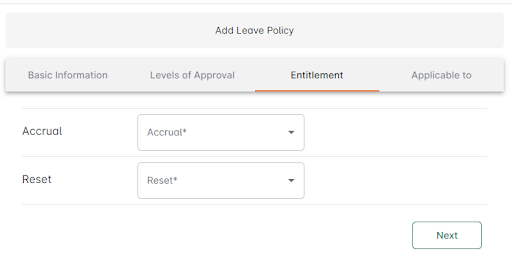

##### Applicable To

In this section, you can define who the leave is 'Applicable' to. You have options like Gender, Marital Status, Department, Designation, Branhh, Role here.

Users can tick on **_Select All Option_** for the **_Branches, Designation, Department, Job Type_** and **_Role_**. If you want to select a particular Branch, Designation, Department, Job type and Role can utilize the **_Search option or the Drop down option. _**

After successfully entering all the details click the **_Submit Button _**on the bottom right side of the page.

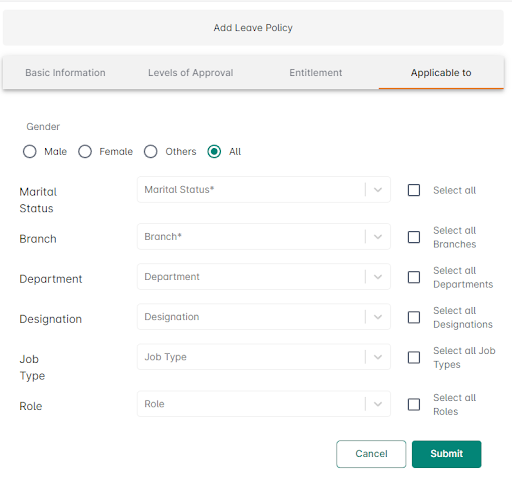

After successfully adding the **_Leave policy_**, it will appear on the page as shown below.

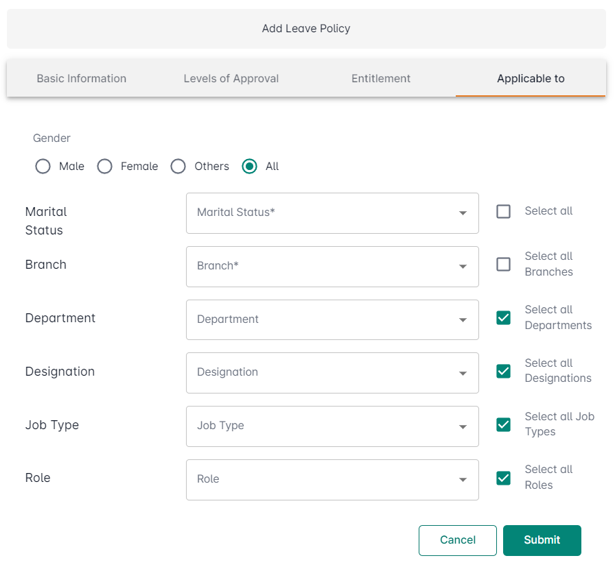

#### To View the Leave policy

Click on a particular **_Leave policy name_** t to view the details. It will appear as shown below.

If the user needs to check a particular **_Leave policy_** he/she can utilize the **_Search Bar_** on the top middle of the page.

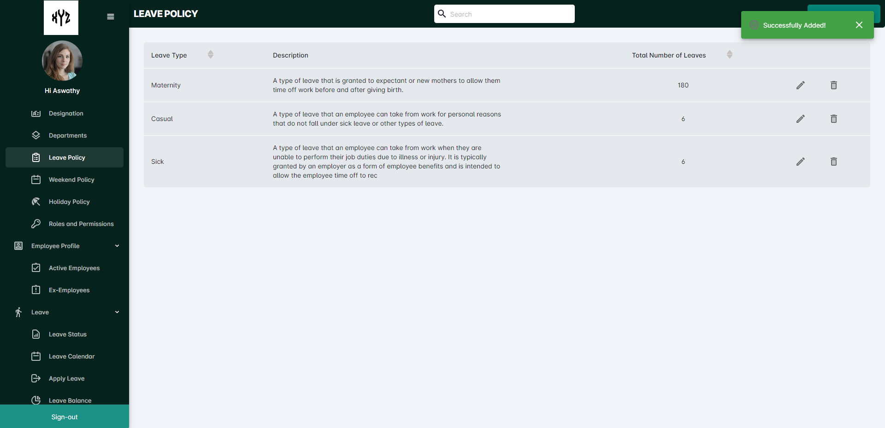

#### To Edit the Leave policy

Click the **_Edit icon_** on the right side of each Leave type to edit the details. It will open a side panel with details enabled to **_edit and submit. _**

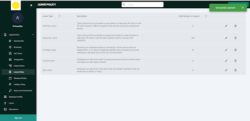

#### To Delete the Leave policy

Click on the **_Delete icon_** next to the Edit icon to delete a particular**_ Leave policy_**. It will open a command box.

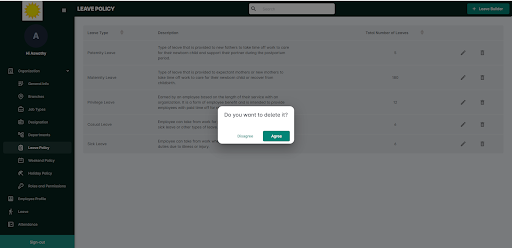

### Weekend Policy

This section contains information about the organization's weekend policy, including details about the number of weekends off, the timing of weekends, and any restrictions or rules related to weekend entitlement.

Click on the **_Weekend Policy_** to view and add Weekends.

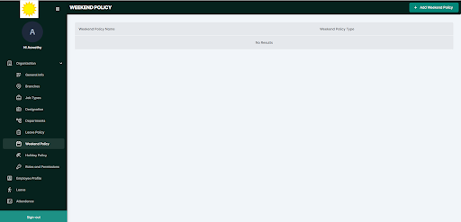

#### Add Weekend policy

Click on the **_+Add Weekend Policy_** option to add new weekends . Enter the details such as: **_Weekend policy name, Type, Weekday, the Branch_** where it is applicable. After entering the details click on the **_Submit button._**

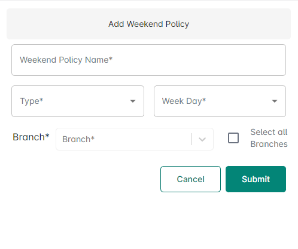

After successfully completing the submission the details will be displayed as shown below.

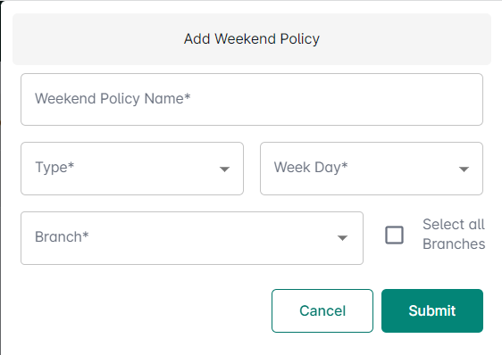

#### View Branches

Click on the **_View Branches _**box on the right side of each **_Weekend type_** to view the details of the branches where it is applicable.

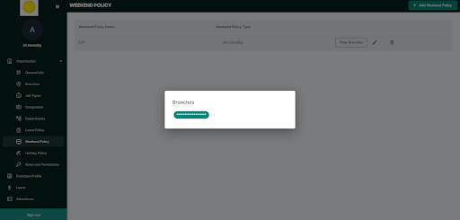

#### View Weekend Policy

Click on a particular **_Weekend policy_** name t to view the details. It will appear as shown below.

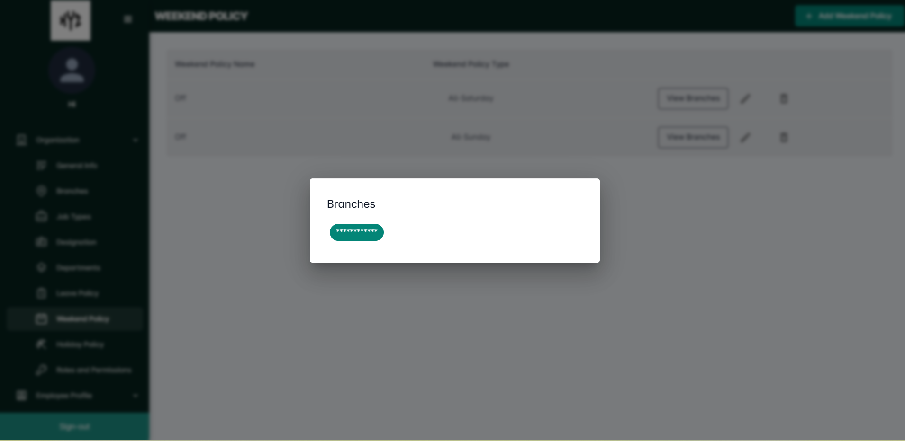

#### Edit Weekend Policy

Click the **_Edit icon _**on the right side of each**_ Weekend Type_** to edit the details. It will open a side panel with details enabled to**_ edit and submit._**

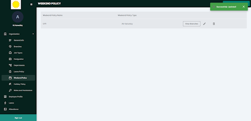

#### Delete Weekend Policy

Click on the **_Delete icon_** next to the Edit icon to delete a particular **_Weekend Policy_**. It will open a command box.

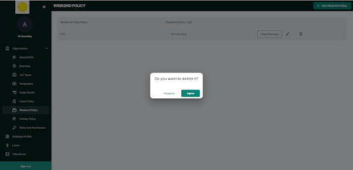

### Holiday Policy

This section contains information about the organization's holiday policy, including details about the type of holidays, number of holidays, the dates of holidays, and any restrictions or rules related to holiday entitlement.

Click on the **_Holiday Policy_** to view and add holidays.

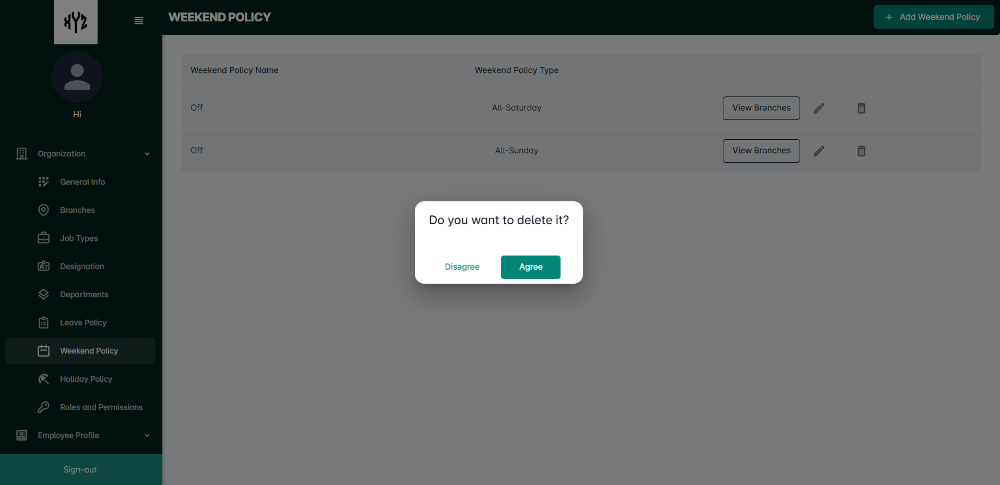

#### Add Holidays

Click on the **_+Add Holiday _**policy option to add new **_Holidays_**. Enter the details such as: **_Holiday name, Date, Type of the Holiday( Whether it is public holiday or optional holiday) , the Branch_** where it is applicable.

After entering the details click on the **_Submit button. _**

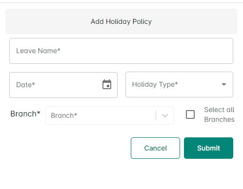

After successfully completing the submission the details will be displayed as shown below.

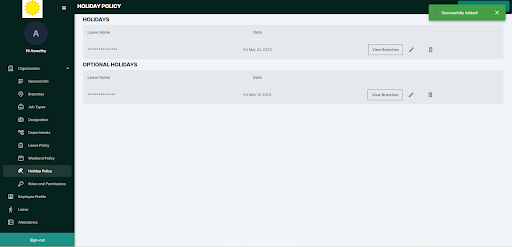

##### View Branches

Click on the **_View Branches_** box on the right side of each **_Holiday type_** to view the details of the branches where the holidays are applicable.

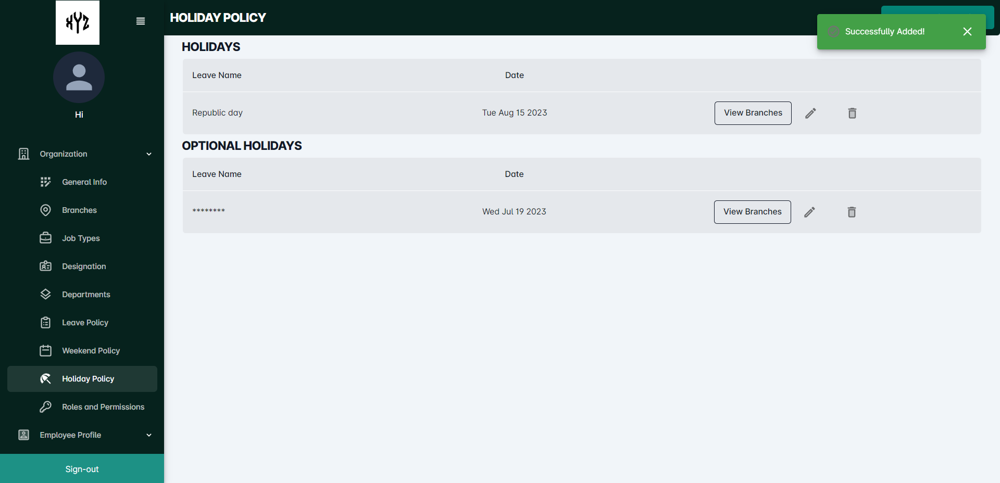

#### View the Holiday details

Click on a particular **_Holiday policy_** name t to view the details. It will appear as shown below.

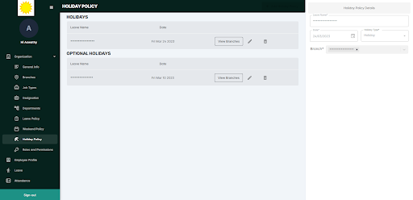

#### Edit Holiday policy

Click the **_Edit icon_** on the right side of each **_Holiday Type_** to edit the details. It will open a side panel with details enabled to **_edit and submit_**.

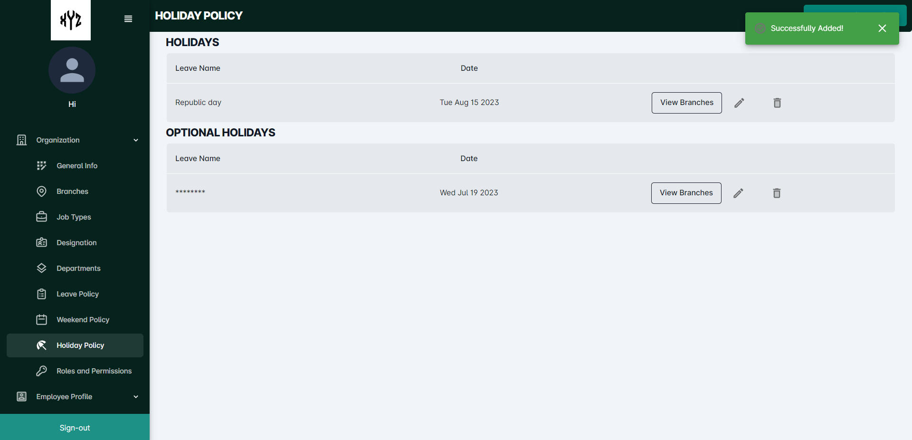

#### Delete the Holiday policy

Click on the **_Delete icon _**next to the Edit icon to delete a particular **_Holiday Policy_**. It will open a command box.

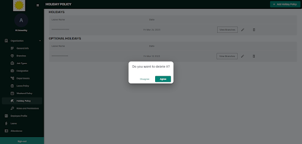

### Roles and Permissions

This section contains information about the different roles and permissions within the organization, including details about the access levels and responsibilities of different roles, such as employee, HR, Admin and Reporting Manager.

Click on the **_Roles and Permissions_** option on the side panel. Before setting up roles and permissions in HRMNest, you need to determine what roles are needed within your organization. Reporting managers, HR personnel, Employees and Adim are default roles in HRMNest . Once you have determined the roles, you can move on to setting up permissions for each role.

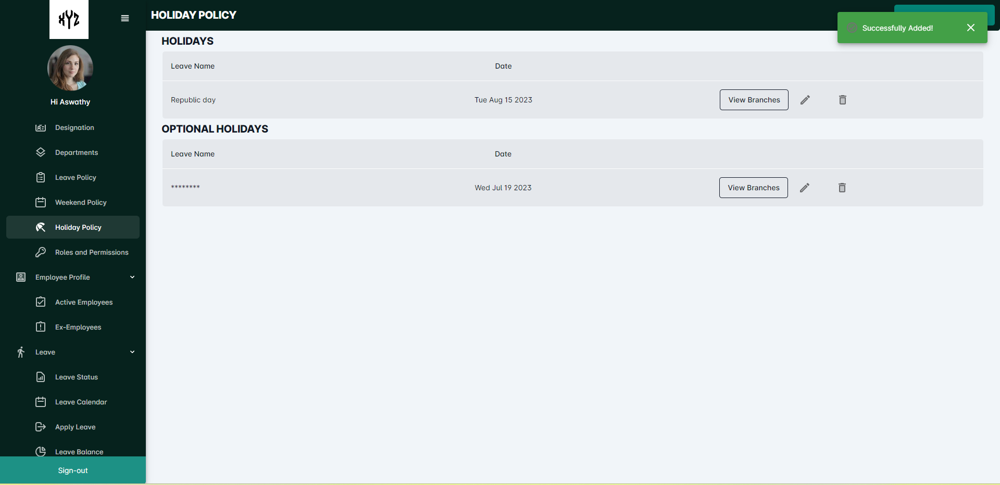

#### Add New Roles

Click on the **_+Add New Role_** on the upper right side of the page. A page shown below will appear. This is where you can add new roles and manage existing ones. Enter the necessary information such as **_Name of the role_** that you would like to create.

After entering the details of the new role, set the role permissions. This is where you can define what actions the user with this role can perform in the system.

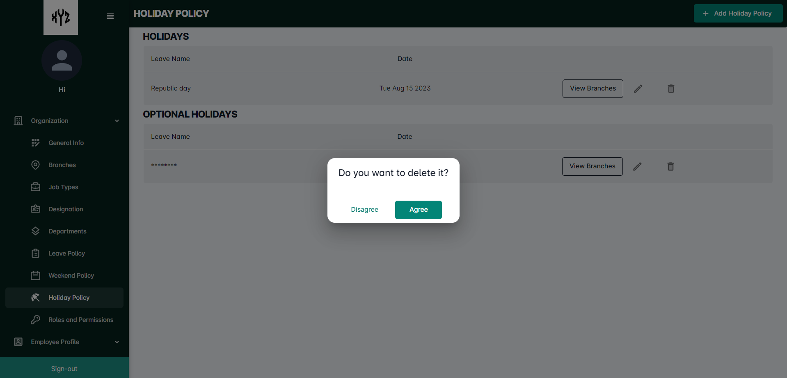

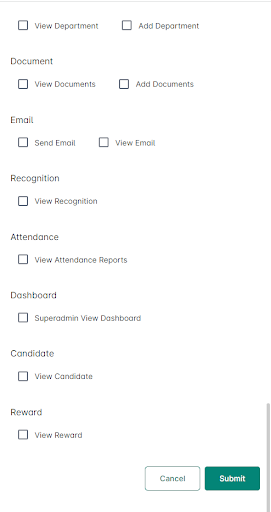

Once you have entered all the necessary details and set the permissions, click on the **_Submit button _**to create the new role.

The new role should now appear in the list of roles in the **_Role section._**

If the user needs to check a particular role, he/she can utilize the **_Search bar_** on the upper middle of the page.

#### View Permissions

To view the permissions details entitled to each role click on the**_ View permissions button_** on the right side of each role. A box containing permissions will be displayed.

Users can make use of the Search bar above the box to search for any particular permissions.

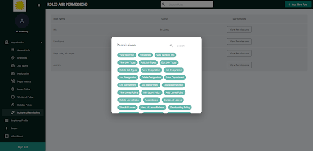

## Employee Profile

An employee profile page provides a comprehensive view of a particular employee's information, including their Personal Details , Designation, Branch, Job Type, Role etc.

### Active Employees

Click on the **_Employee Profile_** option in the side panel. A drop down containing **_Active Employees_** and **_Ex-Employees_** will be displayed. Click on the **_Active Employee_** tab.

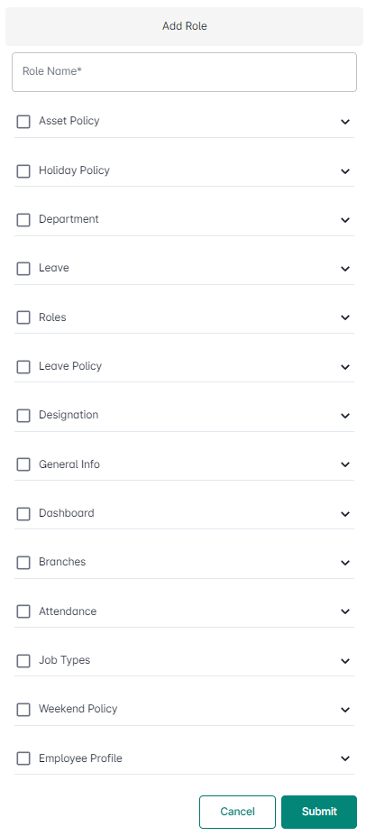

Admin/ owner have to complete their personal profile to add more employees and to complete the onboarding process in HRMNest. Complete the personal profile by clicking on the **_Edit _**icon on the profile tile. A drawer page will open up.

#### General Info

To complete the General Info, click on the **_Complete your profile_** tile. You can provide all details including Personal Info, Designation, Job Type, Branches, Role etc.

Either users can tick on the **_Auto-generated Employee Id_** column to generate an auto-generated employee Id or manually enter the employee Id. If the users select the **_Auto-generated employee Id_** a pop up will appear on the screen showing the Employee Id.

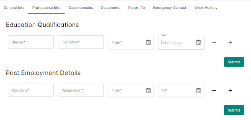

When clicking on the **_Branches, Designation and Department_** option, an already added list of these fields with a **_+ Add_** option will appear. Users can add new **_Branches, Designation, Department_** in this page.

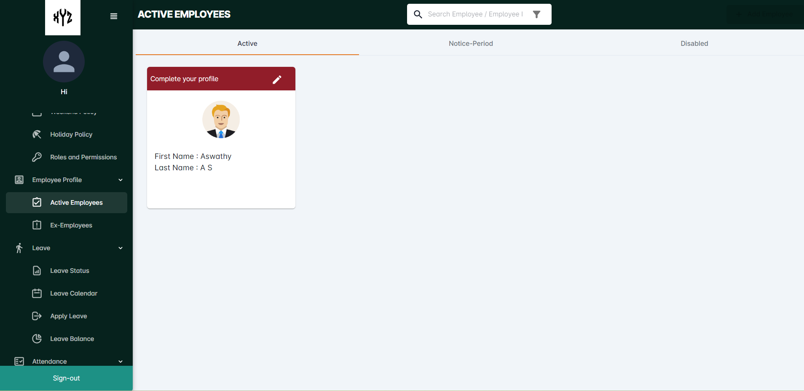

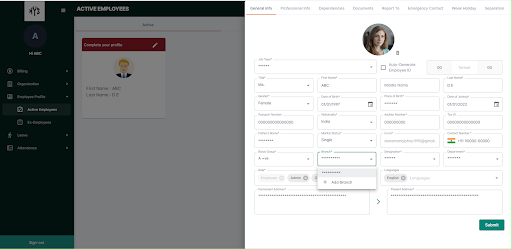

Click on the **_Profile Avatar_** to add a profile photo. If the user needs to change the profile click on the **_Delete icon_** near to the profile avatar.

After entering all mandatory fields click the **_Submit_** button**_._** This will take you to the next section.

#### Professional Info

**_Professional Info_** contains the **_Educational Qualification_** and the **_Past Employment Details._** Users can add more than one professional info by clicking on the **_+symbol_**and can delete the details by clicking on the **_- symbol_**.

Freshers can skip the **_Past Employment Details_** and can **_Submit_** the **_Educational Qualification_** alone.

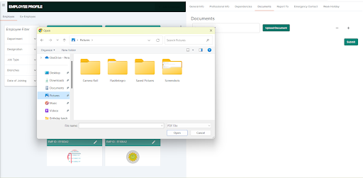

#### Dependencies

This section provides information about the **_Dependencies_** of the employee and the relationship with them.

It contains the details of the **_Dependent Name, Relationship _**with the dependent and their**_ Date of Birth._** You can add more than one dependency by clicking on the **_+_** icon and can delete it by clicking on the **_-_** icon . Enter the details and click the **_Submit_** button.

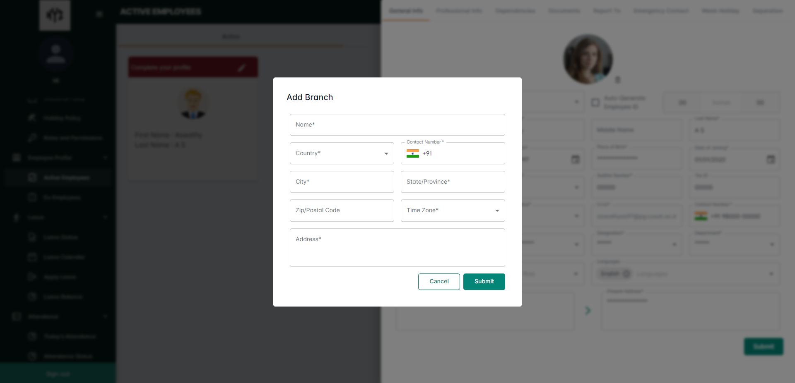

#### Documents

The **_Document_** section allows users to store and manage various types of documents related to employee information such as Educational certificates, Employment certificates etc.

Click on the **_Upload Document_** and can submit it from the device. The file size should be less than **_5 MB_**. Users can add more than one **_Document_** by clicking the **_+_** symbol and can remove the document by clicking the **_-_** symbol.

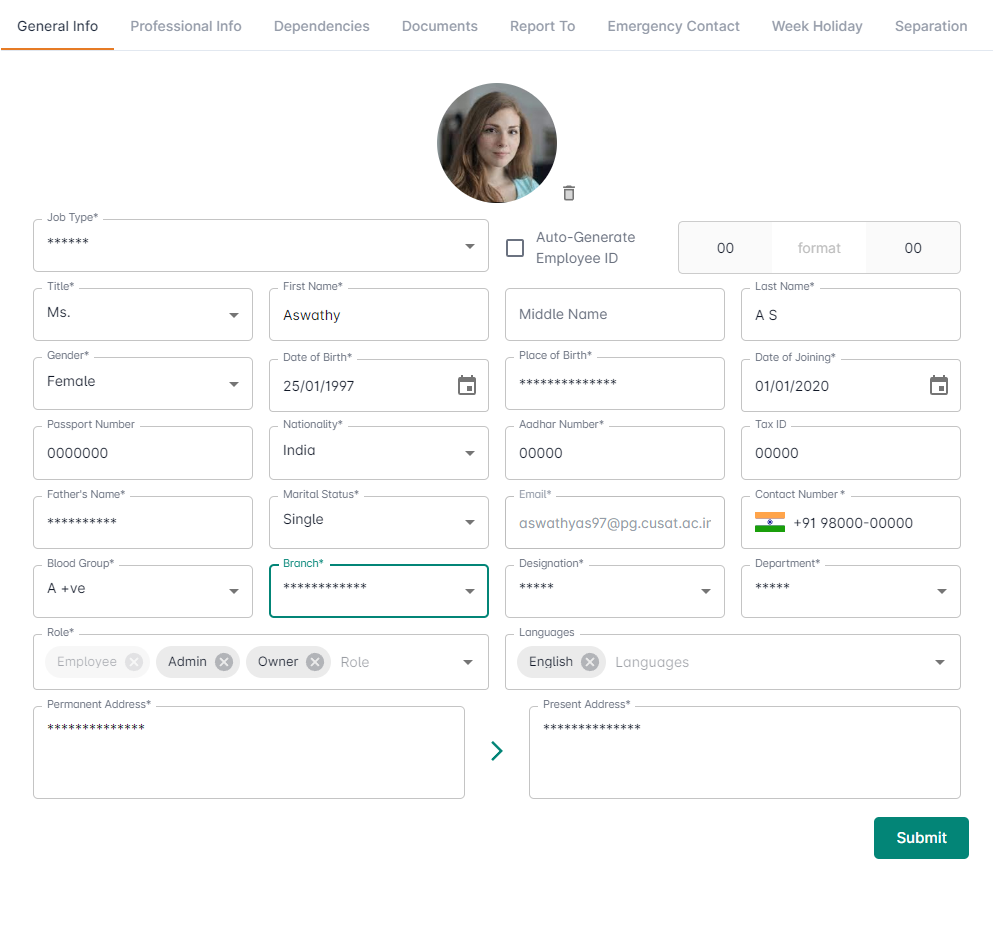

Users need to enter the **_Documents Name_** which is mandatory and click the **_Submit_** button.

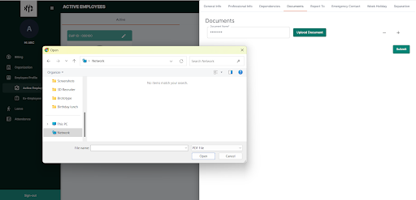

##### Viewing the Document

Click on the **_View Document_** on the right side to view the uploaded document. .

##### Download the Document

Click on the **_Download Document_** button to Download the uploaded documents.

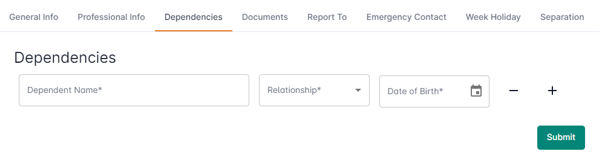

#### Report To

This feature allows users to specify who an employee reports to, who their direct reports are, and the overall structure of the reporting relationships within the organization. The supervisor role has to be defined in the roles and Permissions section.

Click on the **_Drop Down_**on the **_Supervisor_** and **_Subordinate_** fields and select the names. After selecting the names click the **_Submit_** button.

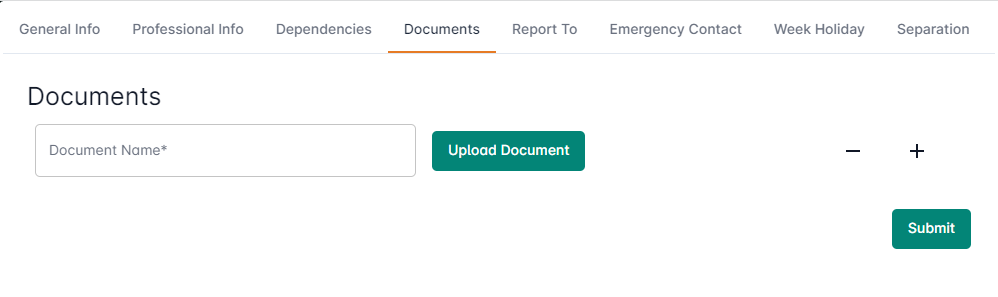

#### Emergency Contact

The **_Emergency Contacts_** section allows employees to provide contact information for individuals who should be notified in case of an emergency.

Enter the **_Contact Name, Phone Number, Relation_** and **_Address_** of the person and click the **_Submit_** button.

Users can add more than one contact by clicking the **_+ icon_** and remove it by clicking the **_- icon_** on the right side of the contact.

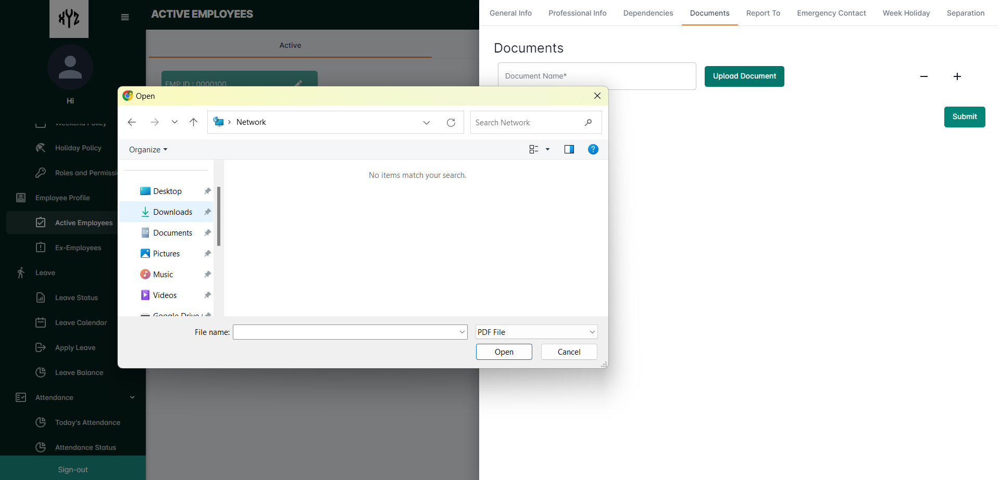

#### Weekholiday

This section contains the **_Weekend Holidays_** of the user. Select the **_Weekend Policy_** that is already defined in the **_Roles and Permissions_** sections from the drop down button and click on the **_Submit_** button.

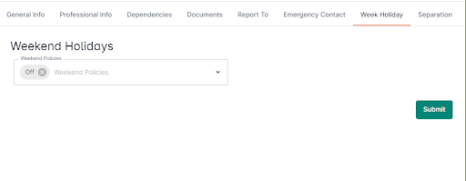

#### Separation

This section contains the separation policy of the organization. It provides a centralized system for HR professionals to handle various types of employee separations, such as terminations, resignations, retirements, or other forms of employment discontinuation. Within the Separation tab, you will find the **_Terminate Employee_** option and a **_Disabled Employee_** option.

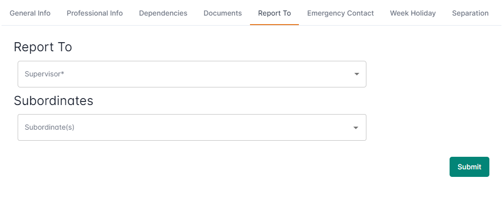

##### Terminate Employee

Select the **_Terminate Employee_** option to initiate the termination process for an employee. Provide a **_reason_** for the termination, which can include voluntary resignation, contract completion, or other applicable reasons from the drop down. Enter the described reason for the termination in the **_Note_** field. Enter the termination **_date_**, which indicates the last working day for the employee.

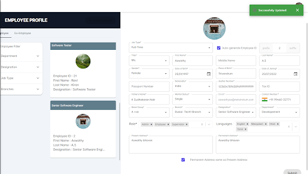

##### Disable Employee

In the **_Separation tab_**, select the **_Disable Employee_** option. The**_ Disable Employee_** feature is typically used when an employee is on a long-term leave, suspension, or when their employment status changes without termination (e.g., change to part-time or temporary status). Provide a reason for disabling the employee in the **_Description_** field.

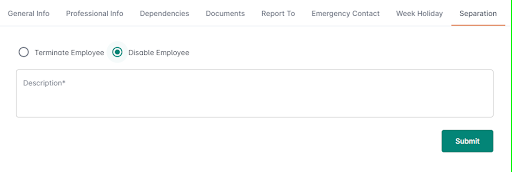

The Employee profile page will look like as shown below after successfully completing the personal profile.

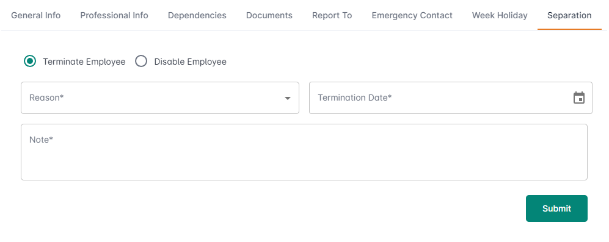

### Add Employee

After successfully completing the personal profile admin can add employees to HRMNest. .

To add more employees to HRMNest, click on the **_+ Add Employee_** option on the upper right side of the page.

A page contains **_General Info, Professional Info, Dependencies, Documents, Report To, Emergency Contact, Week Holidays_** will be displayed. After successful completion of the page click the **_Submit_** button.

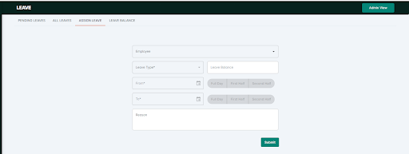

The **_Employee_** Profiles tiles will appear as shown below.

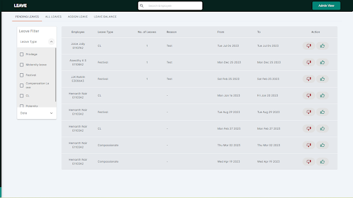

#### Search /Filter

Users can utilize the **_Search Bar_** or the Filter icon above the page to search a particular employee. Users can filter the employees by using the Filter icon on the page. They can filter the employees by **_Departments, Designation, Job Type, Branches and Date of joining_**.

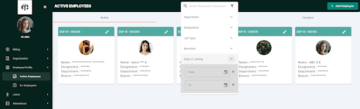

Notice period
Click on the Notice period section which contains the number of employees who are serving their notice period. The Notice Period section allows the admin or HR personnel to set the duration of notice that an employee is required to provide before their termination date in the Terminate Employee section. Select the employee for whom you wish to set the termination status from the list or search option. Click the edit icon and set the employee as terminated in the Separation option.

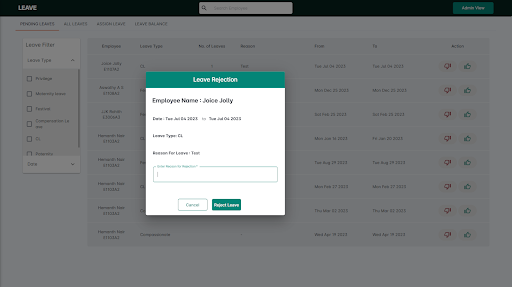

Users can see the status of termination in the **_Separation_** option. Here, the admin can **_Activate the employee_** or **_Disable the employee_** by selecting the respective options.

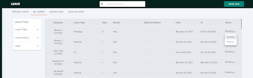

### Disabled

Disabled section allows the admin to manage employees who are temporarily unable to work due to specific circumstances, such as medical leave, extended leaves of absence, or changes in employment status. Select the employee for whom you wish to set the disabled status from the list or search option. Click the **_edit icon_** and set the employee as disabled in the **_Separation_** option.

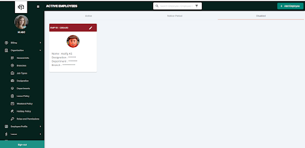

Users can see the status of Disabled in the Separation option. Here, the admin can **_Enable the_** **_employee_** or **_Terminate the employee_** by selecting the respective options.

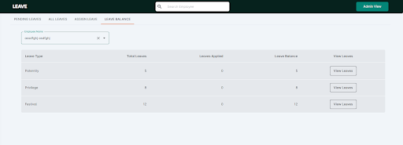

### Edit Employee Profile

To edit the employee details , click on the **_Edit_** icon on the employee profile tile for whom you wish to edit. A drawer page will open up. After successful editing click the **_Submit_** button.

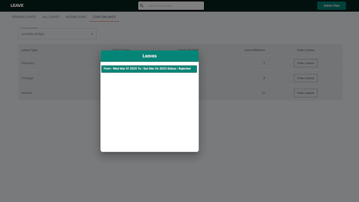

### Ex-Employees

The **_Ex-Employees_** section allows HR professionals to manage information related to employees who are no longer with the organization. This feature provides a centralized location for storing and managing information related to these former employees. Here, users can see the list of employees who completed their notice period and terminated in the **_Terminate Employee_** section.

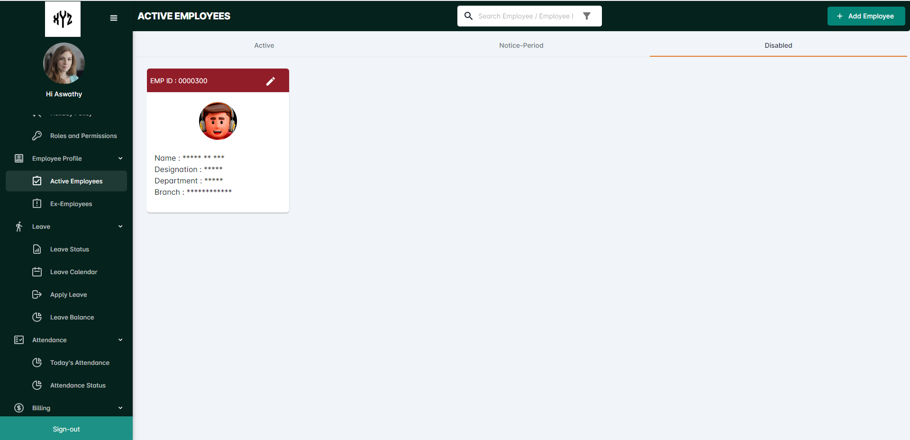

## Leaves

The **_Leave_** section allows employees to manage their leaves, and HR professionals to manage employee leave requests, approvals, and balances. This feature provides a centralized location for managing all aspects of employee leave, from requesting time off to tracking available leave balances.

By clicking on the **_Leave_** option a dropdown contains **_Leave Status, Leave Calendar, Apply Leave_** and **_Leave Balance_** will appear. All the Leave details defined in the **_Leave Policy_** section will be available here. This section includes an **_Admin View_** and a **_User View._**

### Admin View

When clicking on the**_ Leave Status_** from the drop down , by default **_Admin View_** will be displayed. Users can utilize the **_Filter_** icon or **_Search_** option to narrow down the view by **_Leave type, Leave status_** or **_Date_**.

#### Leave Status

Once an employee has submitted a leave request through the **_Apply Leave_**, it is added to the **_Leave Status_** list for approval showing as pending. The Admin/HR manager has the ability to take action on leave requests from the **_Leave Status_** page. Clicking on the respective action button (Approve, Reject, Cancel) allow them to update the status of the leave request.

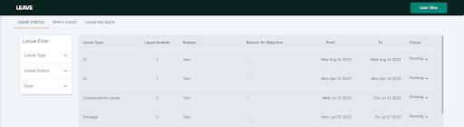

###### **Approve leave requests**

Select the **_Approve_** option from drop down. A pop-up will be displayed asking for approval confirmation.

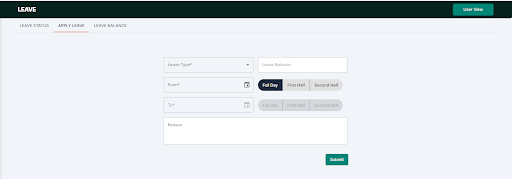

###### **Reject leave requests**

Select the **_Reject_** option from drop down. A pop-up will be displayed asking for rejection confirmation. You have to give a reason for the rejection.

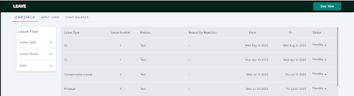

###### **Cancel leave request**

Select the **_Cancel_** option from drop down. A pop-up will be displayed asking for cancellation confirmation.

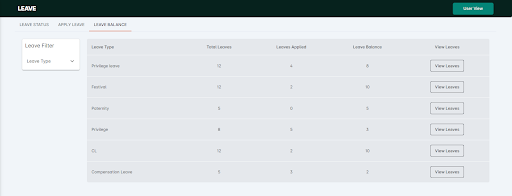

#### Leave Calendar

The **_Leave Calendar_** page will display a visual representation of the leave schedule for your organization, typically in a monthly calendar format. It enables efficient leave planning and coordination, ensuring optimal resource allocation and minimizing scheduling conflicts. Users can see different color codes to indicate various leave statuses and leave types. The **_Leave Calendar_** page allows you to navigate between different months by navigation buttons and date pickers to select the desired time frame and view the corresponding leave schedule.

##### **All Employee View**

To view the **_Leave Calendar_** for all employees, select the **_All Employees_** option from the side toolbar. This will display the leave schedule for all employees in the organization. Users can utilize the **_Label_** option to filter the status of the leaves as approved and pending.

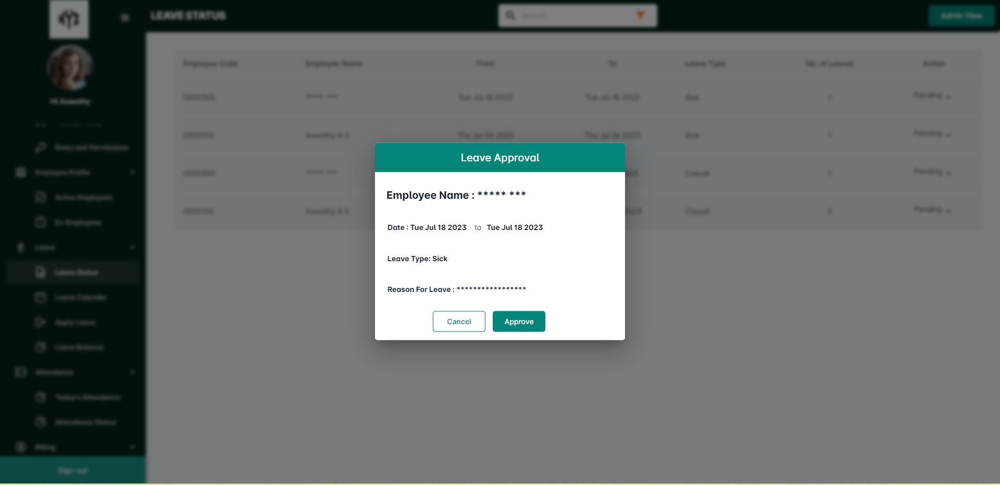

##### **Employee View**

To view the **_Leave Calendar_** for a specific employee, select the **_Employee_** option next to **_All Employees_**. A dropdown will appear, allowing you to select the desired employee's name. Choose the employee for whom you want to view the leave schedule, and the calendar will update to display their leave entries. Users can utilize the **_Label_** option to filter the leaves by their type.

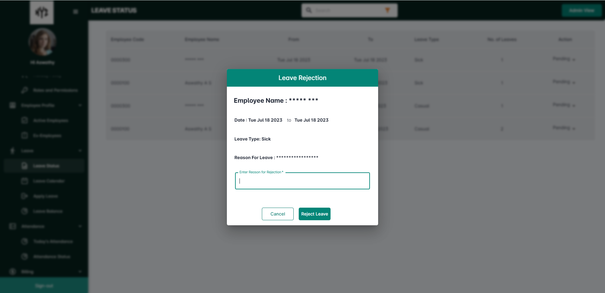

#### Apply Leaves

The admin has the ability to assign leave to an employee on behalf of them. Select the **_Employee Name_** from the drop down**_, Leave Type, From and to Date, Reason_** for the leave if needed ( Not- Mandatory). Click the **_Submit_** button. These leave requests can be view in the **_Leave Status_** option.

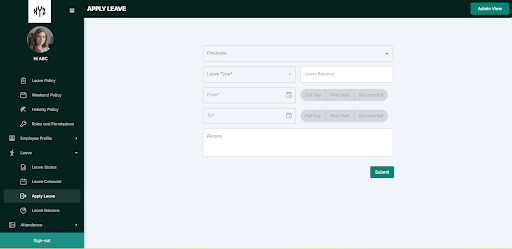

#### Leave Balance

The **_Leave Balances_** allows admin or HR managers to quickly and easily view the leave balances of individual employees, as well as the total leave balances across the organization.

Select the **_Name_** of the employee you wish to view the leave balance from the drop down menu.

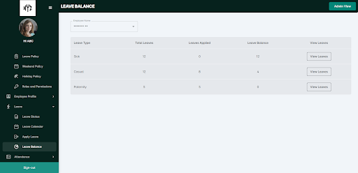

Click the **_View Leaves_** option on the right side of each leave, you can view the leaves and their status taken by that employee.

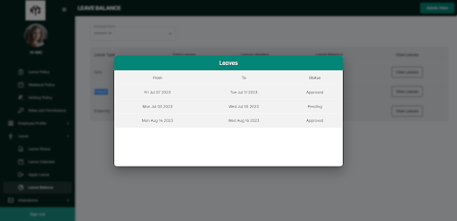

### User View

Switch to **_User View_** function allows an admin or HR manager to switch from the administrative view to the user view. By switching to the user view, the admin or HR manager can see HRMNest from the employee-user view. This allows them to see the same information and interface that the employee sees, which can be useful in troubleshooting any issues or questions that the employee may have.

This section includes **_Leave Status, Apply Leave, Leave Balance_**.

#### Leave Status

Once the employee has submitted a leave request through the **_Apply Leave_**, it is added to the **_Leave Status_** list for approval by an admin or HR manager. The status of each request will be indicated as **_Pending, Approved, Rejected or Canceled_**. Users can utilize the **_Filter_** icon or **_Search_** option to narrow down the view by **_Leave type, Leave status_** or **_Date_**.

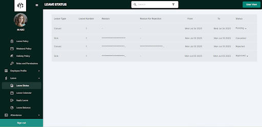

##### **Cancel Leave**

However, if the employee needs to **_Cancel_** their leave for any reason, they can do so by clicking the drop down on the right side of each leave. A Page shown below will be displayed.

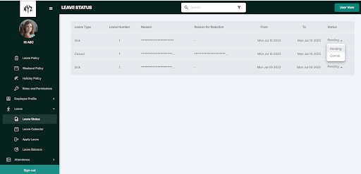

A Page shown below will be displayed for asking the cancellation confirmation.

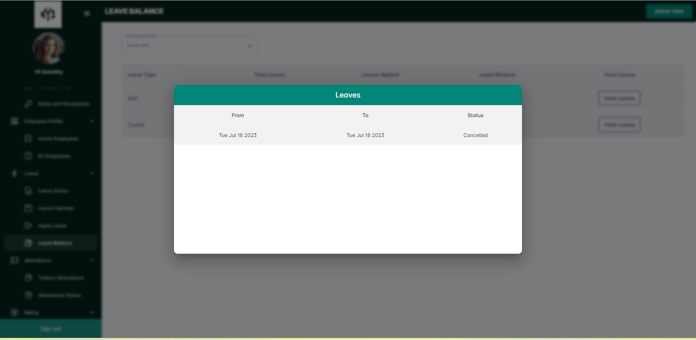

#### Leave Calendar

The **_Leave Calendar_** page will display a visual representation of the leave schedule for the employee, typically in a monthly calendar format. Employees can see different color codes to indicate various leave types. The **_Leave Calendar_** page allows you to navigate between different months by navigation buttons and date pickers to select the desired time frame and view the corresponding leave schedule. Employees can utilize the **_Label_** option to filter the leaves by their type.

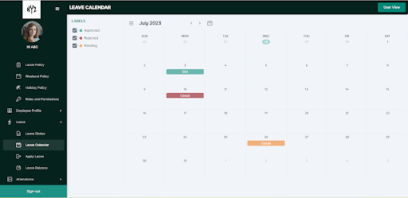

#### Apply Leave

In the user view, the **_Apply Leave_** allows an employee to request time off for a specific period of time, which must be approved by an admin or HR manager. Select the mandatory fields such as, **_Leave Type, From_** and **_To Date, Reason_** for the Leave ( If needed) and click the **_Submit_** button.

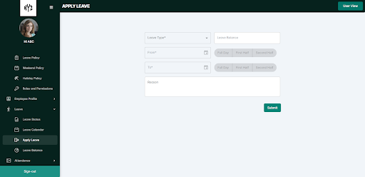

#### Leave Balance

The **_Leave Balance_** section shows the amount of leave remaining for each type for the employees. This information is presented in a clear and easy-to-read format, such as a table. Employees can use the **_Filter_** icon or the **_Search bar_** to view the particular leave types.

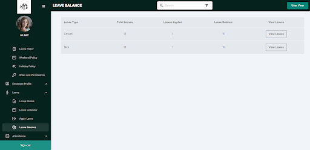

Click on the View Leaves option on each **_leave type_**, which allows the user to view the details of the leaves taken by them.

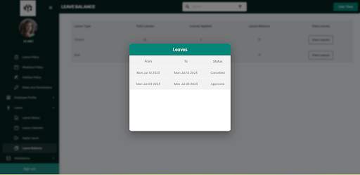
