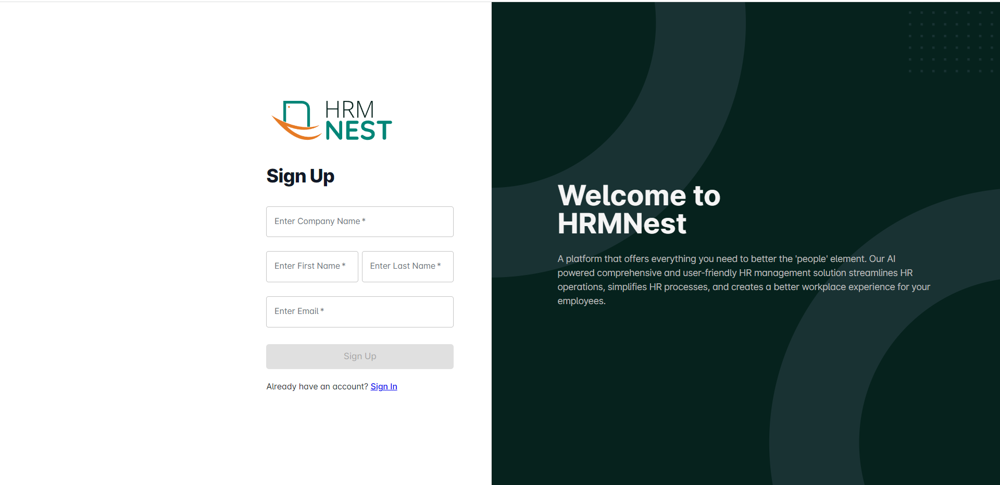
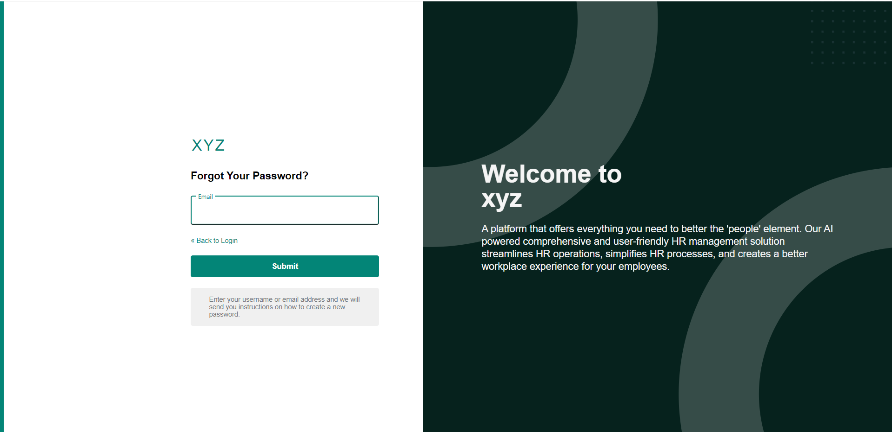

# Sign up 

The sign-up page of HRMNest is the first page that an employee or admin encounters when they access the software. The sign-in page requires the user to enter their login credentials. 

Click on the link- [www.hrmnest.com](https://www.hrmnest.com). It will lead you to the **HRMNest Sign in Page**. New users can create an account by clicking on the **_Sign up_** option. It will lead you to the **_Sign up_** page like below shown.

Enter a valid **Company name, First name, Last name and Email ID** in the corresponding fields and click on the **_Sign up_** option.  

 Your account will be created successfully. Click the **_Continue to Login button_**. 

## Log in 

Upon successful sign in, a page similar to the one shown in the image below will be displayed whereby a user will be required to type in their correct username and password

Enter the **Email Id and  the initial Password sent to the  email id which was used while sign-up** and click the **_Sign in_** button. You can tick on the **_Remember Me_** checkbox if the system  wants to remember your tenant URL. 

## Forget password 

In the instance where a user forgot his password, the **_Forgot Password_** link on the login page is there to assist. On clicking the button  a user will be sent to a page as shown below and required to provide either a **_username or email address_** used initially during registration. After that the user can click the **_Submit button_** to reset the password. A prompt will appear on the page informing that an email has been sent to his particular email account for resetting password. The user can login into his email to follow a link sent to his email and click the attached link to get a HRMNest page for setting a new password. 

If the user already has an account in HRMNest, after clicking on  the official website they will redirect to the sign -in page. They can enter the **Tenant name** and click on the **Sign in** button.

